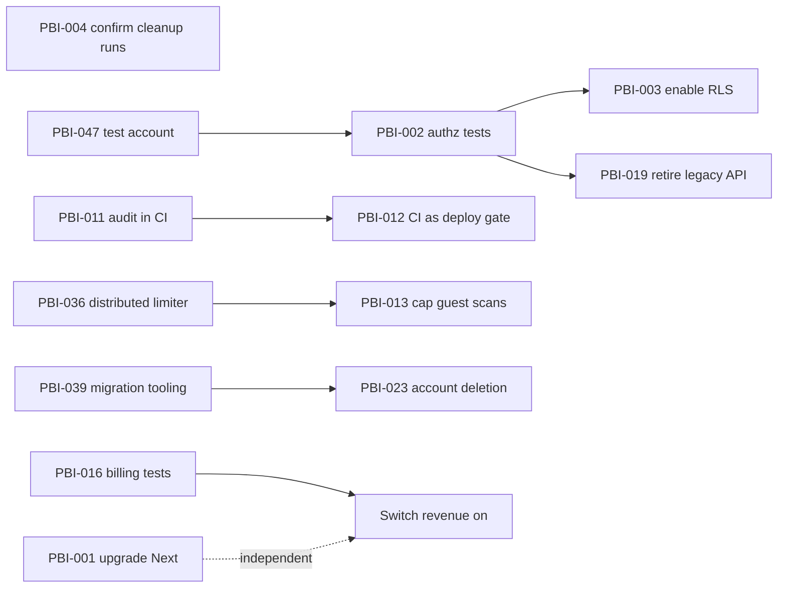

# Splitzy — Improvement Backlog

> **64 open items**, plus one fixed during the review — synthesised from every gap, debt item, UX
> finding and vulnerability across Phases A–D. Sorted **Critical → High → Medium → Low**, and within
> each priority by value delivered.
>
> This is the **engineering register** — full detail on every item. The stakeholder-facing view is
> [../product/product-backlog.md](../product/product-backlog.md), which presents the same items
> grouped for decision-making rather than execution.
>
> **[TECHNICAL-ONLY]** Priority here reflects *technical risk and code evidence*. It does not
> incorporate business priorities, user research or market context.
>
> Sources: `GAP` → [product-gaps.md](./product-gaps.md) · `TD` →
> [technical-debt.md](./technical-debt.md) · `UXD` → [ux-debt.md](./ux-debt.md) · `UX` →
> [../ux/ux-audit.md](../ux/ux-audit.md) · `VULN` → private findings, referenced **by ID only**.

---

## Distribution

| Priority | Count | Effort profile |
|---|---|---|
| ✅ Done | 1 | — |
| **Critical** | 4 | 2 Small · 2 Medium |
| **High** | 19 | 13 Small · 5 Medium · 1 Large |
| **Medium** | 24 | 17 Small · 7 Medium |
| **Low** | 17 | 10 Small · 3 Medium · 4 Large |
| **Open total** | **64** | **42 Small · 17 Medium · 5 Large** |

**[INFERRED]** 42 of 64 open items are **Small**, and all five Large items are either a compliance
obligation (PBI-023) or a deliberate product bet (PBI-061 – PBI-063). That is the signature of a
codebase whose problems are completion and verification rather than design — most of this backlog is
finishing work that already exists.

---

## ✅ Completed during this documentation project

### PBI-000 — Protected route open to anonymous visitors
**Type** Security · **Priority** Critical · **Status** ✅ **Fixed and verified**
**Problem** `/multiple` was declared auth-protected and returned 200 with the complete tool to any
anonymous request.
**Current behaviour** Anonymous `GET /multiple` → **307** to `/?login=required`.
**Root cause** The proxy admitted any auth error that was not a 401, but a session-less request
throws `AuthSessionMissingError` with status **400**.
**Resolution** The guard now matches `isAuthRetryableFetchError`; `MultipleReceiptView` gained a
page-level gate. Verified in a browser; full gate green.
**Source** UX-001, VULN-001

---

## CRITICAL

### PBI-001 — Upgrade Next.js past the proxy-bypass advisory
**Type** Security · **Priority** Critical · **Effort** Small
**Problem** `next@16.2.10` carries a high-severity **Middleware / Proxy bypass in App Router**
advisory covering the installed range.
**Current** Route protection, canonical-host redirect, the `/en` redirect and maintenance mode are
enforced **entirely in the proxy** — precisely what the advisory targets.
**Desired** Next ≥ 16.3.3; advisory cleared.
**Business value** PBI-000 closed one path to this failure. This is the **second, independent
path**, and it is still open.
**User impact** None visible; the exposure is a control that can be circumvented.
**Technical impact** `npm audit fix` also clears the `postcss` and `nanoid` advisories.
**Dependencies** None. Re-run the full gate afterwards and confirm `/single`, `/multiple`, `/travel`
remain `○`.
**Acceptance** `npm audit --audit-level=high` reports no `next` advisory; anonymous `GET /multiple`
still 307s; build output shows three static tool routes.
**Source** VULN-002, TD-017

### PBI-002 — Authorization regression tests
**Type** Technical Debt · **Priority** Critical · **Effort** Medium
**Problem** **No test anywhere asserts an authorization rule.** Not one checks that a non-owner gets
403, a non-member gets 404, or a non-admin is refused.
**Current** 12 authorization, money and integrity rules are guaranteed by code review alone.
**Desired** TC-013 … TC-028 automated and in CI.
**Business value** This is the debt that already cost something — PBI-000 was found by rendering the
app, not by a test. Highest value per hour in the backlog.
**User impact** None directly; it is what prevents the next data-exposure bug.
**Technical impact** Needs a Prisma test strategy. Cheapest path: extract authorization predicates
(`getTripAccess`, the "involved" test) into pure functions and unit-test those first.
**Dependencies** PBI-047 (seeded account) for the handler-level subset; the pure-function subset
needs nothing.
**Acceptance** All 16 cases in `test-cases.md` §2 run in CI; TC-013 fails if the PBI-000 fix is
reverted.
**Source** TD-011, VULN-010

### PBI-003 — Enable Row Level Security
**Type** Security · **Priority** Critical · **Effort** Medium
**Problem** No database-level authorization exists in the repository. Prisma connects with a
full-privilege string.
**Current** Application code is the **only** authorization layer — one missed guard is a complete
breach.
**Desired** RLS enabled at minimum on `receipts`, `trips`, `trip_receipts`, `trip_payments`,
`trip_members`, `shared_summaries`, `payments`, with policies **committed to `prisma/sql/`**.
**Business value** Turns "one missed guard = breach" into "one missed guard = blocked query".
**User impact** None if done correctly; a badly-scoped policy breaks reads, so it needs care.
**Technical impact** Must be verified against the two-namespace model — participants live in JSON and
cannot be expressed in a policy.
**Dependencies** GAP-032 must be answered first: **[UNKNOWN]** whether RLS is already on.
**Acceptance** `pg_class.relrowsecurity` true for the listed tables; policy SQL in version control;
the full test suite still passes.
**Source** VULN-010, TD-001, GAP-032

### PBI-004 — Confirm the retention job actually runs
**Type** Bug · **Priority** Critical · **Effort** Small
**Problem** The cleanup endpoint exists but is **not in `vercel.json`**, and `CLEANUP_TOKEN` is
absent from `.env.example`.
**Current** **[UNKNOWN]** whether any retention policy executes.
**Desired** Scheduled, credentialed, and confirmed running.
**Business value** If it is not running, BR-072 – BR-077 are policies nothing enforces: expired share
links **containing bank details**, lapsed saved splits, expired invites and 30-day-old activity
events all persist indefinitely. That is a data-retention exposure, not a tidiness issue.
**User impact** Data the product promised to delete is retained.
**Technical impact** Five-minute check that resolves four business rules.
**Dependencies** None.
**Acceptance** A cron entry exists; `CLEANUP_TOKEN` is set and documented; one run is observed.
**Source** GAP-014, GAP-033, VULN-008

---

## HIGH

### PBI-005 — Fire `split_completed`
**Type** Product Enhancement · **Priority** High · **Effort** Small
**Problem** The core conversion event is declared in `EVENTS` and **never fired**. `mode_selected`
and `pricing_viewed` likewise; `identify()` and `resetAnalytics()` are exported and never called.
**Current** The product cannot answer *what fraction of visitors finish a split* — the question the
analytics were added for. No PostHog person profiles exist.
**Desired** `split_completed` fired at the summary step; `identify()` on sign-in, `reset()` on
sign-out.
**Business value** Highest information value per line of code in the backlog. Every later
prioritisation decision is currently unmeasurable.
**Technical impact** One-line change plus two hook calls.
**Acceptance** The funnel `$pageview → mode_selected → scan_completed → split_completed →
upgrade_clicked` is queryable end to end.
**Source** GAP-027

### PBI-006 — Report handled errors
**Type** Technical Debt · **Priority** High · **Effort** Small
**Problem** Zero `captureException` calls. `ErrorBoundary.onError` — written explicitly for error
monitoring — is never supplied. No source-map upload.
**Current** Every handled failure (payment, sync, email, referral, discarded outbox op, section
crash) is `console`-only and invisible in production.
**Desired** `captureException` on the swallowed catches; `onError` supplied at every boundary;
`withSentryConfig` enabled.
**Business value** This is *why other defects stay undiscovered* — the PWA icon defect went unnoticed
for months for the same reason.
**Acceptance** A deliberately induced section crash and a failed checkout both appear in Sentry with
readable stack traces.
**Source** GAP-028, UX-019, TD-011 neighbourhood

### PBI-007 — Fix dark-mode primary contrast
**Type** Accessibility · **Priority** High · **Effort** Small
**Problem** Dark-mode `--primary` with white foreground measures **3.27:1** — below AA for normal
text, on **every primary button and badge in dark mode**. The 404 badge measures **2.15:1**.
**Current** Measured in a browser across three screens.
**Desired** ≥ 4.5:1. Darkening dark `--primary` to ≈ `78 50% 30%` reaches ~4.6:1; the 404 badge
should use `text-accent-strong`.
**Business value** Systematic accessibility exclusion on the primary action colour.
**Technical impact** Two token values and one class. Add contrast assertions to E2E so it cannot
regress.
**Acceptance** All primary CTAs ≥ 4.5:1 in both themes, asserted in the E2E suite.
**Source** UXD-003, UX-011

### PBI-008 — Add an `<h1>` to five product screens
**Type** Accessibility · **Priority** High · **Effort** Small
**Problem** `/single`, `/multiple`, `/share`, `/s/[code]` and `/invite/[token]` render with **zero**
`<h1>`.
**Current** Marketing routes are scrupulous (E2E-asserted); product routes have none.
**Desired** Exactly one `<h1>` per screen, promoted from the existing header title. No visual change.
**Business value** Removes an accessibility exclusion from the core screen and the main non-user
touchpoint; also helps two indexable routes.
**Acceptance** Every screen has exactly one `<h1>`; the E2E heading assertion is extended to product
routes.
**Source** UXD-002, UX-002

### PBI-009 — Wire up delete for saved splits
**Type** Feature · **Priority** High · **Effort** Small
**Problem** `DELETE /api/receipts/[id]`, `POST …/restore` and `supabaseDataService.deleteReceipt()`
all exist, creator-gated and rate-limited, with **zero callers**.
**Current** A user cannot remove a saved split and must wait seven days for the TTL.
**Desired** A delete action on the history card with an undo toast.
**Business value** Basic data control, with the entire backend already built.
**Technical impact** UI only; the restore endpoint is already idempotent.
**Acceptance** Delete removes the card, an undo toast restores it, and a non-creator gets 403.
**Source** GAP-011, UXD-005, UX-015

### PBI-010 — Localise the share page
**Type** UX Improvement · **Priority** High · **Effort** Medium
**Problem** `/s/[code]` and `/share` are hardcoded English.
**Current** The screen a **non-user** is most likely to see — arriving from an Indonesian WhatsApp
message and being asked to transfer money — is in the wrong language.
**Desired** Both rendered through the dictionary.
**Business value** The product's viral surface, in its actual market's language.
**Technical impact** The infrastructure exists and is type-checked; this is translation work.
**Acceptance** Both screens render fully in `id` and `en`.
**Source** GAP-013, UXD-004

### PBI-011 — `npm audit` in CI
**Type** Security · **Priority** High · **Effort** Small
**Problem** Nine high advisories are invisible to the pipeline.
**Desired** `npm audit --audit-level=high` as a CI step.
**Business value** Makes the next PBI-001 self-reporting instead of discovered by accident.
**Acceptance** CI fails on a new high advisory.
**Source** TD-013, TD-018

### PBI-012 — Make CI a deploy gate
**Type** Technical Debt · **Priority** High · **Effort** Small
**Problem** Vercel deploys from `main` independently; a red CI run does not block production.
**Desired** Deployment gated on the `verify` and `e2e` jobs.
**Business value** Every other quality investment is advisory until this is true.
**Acceptance** A commit with a failing test does not reach production.
**Source** TD-021

### PBI-013 — Cap anonymous AI scanning
**Type** Security · **Priority** High · **Effort** Small
**Problem** The monthly quota is enforced only for authenticated users; anonymous scanning is bounded
solely by 10/minute/IP on a per-instance limiter.
**Current** Uncapped billable Gemini spend with no attribution and no alerting.
**Desired** A per-IP daily cap, plus a spend alert on the Gemini project.
**Business value** Directly bounds the product's only variable cost.
**Dependencies** PBI-036 makes the limit actually global.
**Acceptance** An anonymous client exceeding the daily cap receives 429.
**Source** GAP-015, VULN-006

### PBI-014 — Resolve the settle-up semantic divergence
**Type** UX Improvement · **Priority** High · **Effort** Medium
**Problem** The same-looking "mark as paid" control writes a real ledger row in Travel and a
cosmetic `localStorage` flag in Single/Multiple — which silently resets when an amount changes.
**Desired** Either honest labelling ("crossed off on this device") or parity.
**Business value** Money is involved, and the marker vanishing after an edit reads as data loss.
**Technical impact** Labelling is a copy change; parity is a feature.
**Acceptance** A user can tell, from the UI alone, whether marking paid changes the numbers.
**Source** GAP-018, UXD-001, UX-007

### PBI-015 — One E2E test that completes a split
**Type** Technical Debt · **Priority** High · **Effort** Small
**Problem** No E2E covers the core journey. The 15 existing tests are 13 SEO regressions and 2
navigation assertions.
**Desired** Participants → items → assign → summary, asserting the settlement figures.
**Business value** The most-used path in the product currently has no end-to-end coverage.
**Technical impact** Phase C demonstrated the wizard is scriptable, so cost is low.
**Acceptance** The test fails if any allocation rule regresses.
**Source** TD-014

### PBI-016 — Route-handler tests for billing
**Type** Technical Debt · **Priority** High · **Effort** Medium
**Problem** Zero route-handler tests. Revenue correctness — TC-113, duplicate-webhook idempotency —
is unverified.
**Desired** Coverage of checkout, webhook idempotency, entitlement grant and the flag-off 404.
**Business value** **Must be green before `FLAG_XENDIT_CHECKOUT` is switched on.** A duplicate
delivery double-granting Pro is a revenue bug that would be invisible.
**Dependencies** Blocks PBI-023-adjacent revenue launch.
**Acceptance** TC-110 – TC-114 automated.
**Source** TD-012

### PBI-017 — Localise the legal pages
**Type** UX Improvement · **Priority** High · **Effort** Medium
**Problem** `/privacy` and `/terms` are English-only, in an Indonesian market.
**Business value** Legal documents the audience may not be able to read.
**Acceptance** Both available at `/id/privacy` and `/id/terms` with reciprocal hreflang.
**Source** GAP-013, UXD-004

### PBI-018 — CSRF test case
**Type** Security · **Priority** High · **Effort** Small
**Problem** BR-088 is the only critical business rule with **no test case at all**.
**Current** CSRF protection is applied by convention at the top of every handler; a new handler
omitting it would be caught by nothing.
**Acceptance** A cross-origin POST receives 403; the case is in the P1 regression block.
**Source** GAP-003

### PBI-019 — Retire the legacy trips API
**Type** Technical Debt · **Priority** High · **Effort** Medium
**Problem** 10 fully-writable endpoints with no caller, plus two entities (`ReceiptItem`,
`ItemAssignment`) written only by them.
**Desired** Endpoints removed; entities dropped once no rows depend on them; the Expand–Contract
migration completed.
**Business value** Removes 19 % of the API surface and two of fifteen entities.
**Technical impact** Must first confirm no production rows still read through the relational path.
**Acceptance** `/api/trips/*` returns 404; the schema no longer defines the two tables.
**Source** GAP-023, GAP-029, TD-002, TD-004

### PBI-020 — Resolve "Priority AI processing"
**Type** Product Enhancement · **Priority** High · **Effort** Small
**Problem** Advertised in `PRO_FEATURES` with **no implementation** — Pro and free share the same
model, rate limit and queue.
**Desired** Implemented, or removed from the pricing page.
**Business value** The only outright false paid-tier claim found. Removing the line costs nothing.
**Acceptance** Every `PRO_FEATURES` entry is either implemented or absent.
**Source** GAP-030

### PBI-021 — Replace placeholder social proof
**Type** Product Enhancement · **Priority** High · **Effort** Small
**Problem** Landing statistics, three named testimonials and a 5-star rating are fabricated.
**Current** The team understood the risk well enough to block `aggregateRating` markup via an E2E
test — but the claims remain on the page.
**Desired** Real figures, or removal.
**Business value** A trust liability whose most credible element is the invented one.
**Acceptance** No unsourced quantitative claim on the landing page.
**Source** GAP-031

### PBI-022 — Update the README
**Type** Technical Debt · **Priority** High · **Effort** Small
**Problem** States **Next.js 15** (runs 16) and describes only Single and Trip mode — omitting Travel
Spend, Pro, referrals, admin, i18n and the PWA.
**Desired** Accurate, pointing at `docs/`.
**Business value** The repository's front door contradicts its own documentation.
**Acceptance** Stack, features and setup match reality.
**Source** TD-025

### PBI-023 — Make account deletion possible
**Type** Feature · **Priority** High · **Effort** Large
**Problem** Not merely unbuilt — **impossible**. Five `User` relations use `Restrict`, so the database
refuses to delete a user with any activity.
**Desired** A defined erasure path: anonymise-in-place or cascade.
**Business value** Compliance exposure. The product stores emails, bank details and spending history;
a data-subject erasure request cannot currently be honoured.
**Technical impact** Requires a schema migration and a decision on semantics — the audit trail is
deliberately FK-free so it survives deletion, which constrains the design.
**Dependencies** PBI-039 (migration tooling) makes this safer.
**Acceptance** A user can delete their account; the audit trail survives; no FK error.
**Source** GAP-006, FR-012

---

## MEDIUM

All fields present, condensed for density.

| PBI | Title | Type | Problem → Desired | Value / Impact | Effort | Source |
|---|---|---|---|---|---|---|
| PBI-024 | Wire CSV export, or delete it | Feature | 110 tested lines with zero callers → an Export action, or removal | Serves the expense-claim user, or stops pretending to | S | GAP-012, UXD-005 |
| PBI-025 | Dashboard error states | UX | Both fetches `.catch(() => {})`; failure renders nothing → error + retry | The one screen where the app's own error standard was not applied | S | UXD-006 |
| PBI-026 | Standardise loading affordances | UX | Four treatments, no `loading.tsx` → skeletons for lists, spinners for actions | Slow navigations currently show nothing | M | GAP-020, UXD-007 |
| PBI-027 | Adopt `EmptyState` | UX | Primitive with zero consumers → use it, or delete it | Empty states are good but each is bespoke and will drift | S | GAP-025, UXD-008 |
| PBI-028 | Save prompt after sign-in | UX | Local work silently abandoned → offer "save this split to your account" | The likeliest sign-in moment happens mid-split | S | UXD-009 |
| PBI-029 | Warn on unassigned items | UX | Cost silently shifts to the payer → flag it with the amount | Contradicts the product's own "every rupiah traceable" claim | S | UXD-010, GAP-018 |
| PBI-030 | Disclose what a share link contains | Security/UX | Bank details enter a 14-day public snapshot silently → state it at creation, offer a toggle | The scan flow already does this well ten lines away | S | UXD-011, VULN-005 |
| PBI-031 | Consistent ban enforcement | Security | `/api/auth/me` skips the guard; sessions never revoked → apply guard, consider admin sign-out | Small disclosure; demonstrates the guard can be bypassed by a different auth path | S | GAP-022, VULN-003 |
| PBI-032 | Stop disclosing the inviter's email | Security | `invitedBy` falls back to `creator.email` → fall back to "Someone" | A leaked invite exposes an address on an unauthenticated page | S | VULN-004 |
| PBI-033 | Rate-limit and bound `/api/fx-rate` | Security/Perf | Public, keyless, unlimited, unbounded cache → limit + eviction + currency allowlist | Free invocations and slow per-instance memory growth | S | VULN-007, TD-030 |
| PBI-034 | Remove `GET = POST` on cleanup | Security | A GET performs destructive hard deletes → POST only | Reachable by prefetch, scanners, a pasted URL | S | VULN-008 |
| PBI-035 | Editable display name | Feature | No profile UI; name overwritten from Google → let users set a display name | Also closes the null-name path that leaks the inviter's email | S | GAP-005, FR-011 |
| PBI-036 | Migrate rate limiting to the distributed path | Perf | Only 2 of ~30 endpoints use the async path → migrate the rest | Enabling the flag today changes almost nothing | M | GAP-016, TD-032 |
| PBI-037 | Make the quota check atomic | Perf | `check` then `increment` are separate → single atomic operation | Concurrent scans can exceed the paid cap | S | TD-031 |
| PBI-038 | Paginate `GET /api/travel` | Perf | Every trip fully hydrated, capped at 200 → summary list + lazy detail | Response grows with total history, not with what is shown. Flagged in-code | M | TD-027 |
| PBI-039 | Adopt migration tooling with history | Config | Hand-applied SQL, no history table → a real migration tool | Drift detectable only by inspection; one type inconsistency already exists | M | TD-020 |
| PBI-040 | Validate environment at boot | Config | Missing vars surface as runtime failures behind `!` assertions → fail fast, named | A misconfigured deploy fails at first request without saying why | S | TD-023 |
| PBI-041 | Document `CLEANUP_TOKEN`, `NEXT_PUBLIC_APP_URL` | Config | Used in code, absent from `.env.example` → document both | Unset `CLEANUP_TOKEN` weakens the cleanup route's auth | S | TD-022 |
| PBI-042 | Finish the token migration | UX | 104 raw palette classes, ~65 with no `dark:` pair → migrate to semantic tokens | Latent dark-mode inconsistency; tokens already carry contrast ratios | M | UXD-013, GAP-021 |
| PBI-043 | Close the documentation consistency gaps | Technical Debt | FR-011/012/019 have no story; API-001/006/030 absent from the matrix → reconcile | Keeps the traceability matrix trustworthy | S | GAP-001, GAP-002, GAP-004 |
| PBI-044 | One success-response shape | Technical Debt | `{ ok: true }` vs `{ success: true }` → pick one | Cosmetic now; a real cost for any future consumer | S | GAP-019, TD-009 |
| PBI-045 | Automated accessibility testing | Accessibility | Good affordances, **zero** automated verification → axe/pa11y in CI | Nothing prevents an a11y regression | S | UX-audit §a11y |
| PBI-046 | Client data cache | Perf | No cache; history/dashboard/admin refetch on every mount → SWR or React Query | Redundant requests, visible re-loading | M | TD-028 |
| PBI-047 | Seeded test account **— treat as High** | Technical Debt | Six screens unreachable by any harness → a Supabase test user on staging | Unblocks authenticated E2E and visual coverage. **No longer hypothetical:** fixing VULN-001 made `/multiple` redirect anonymous visitors, so 4 E2E tests that measured it are now `test.skip` and one overflow check dropped the route. Those are dormant regressions until this lands | M | test-strategy §6 |

---

## LOW

| PBI | Title | Type | Problem → Desired | Effort | Source |
|---|---|---|---|---|---|
| PBI-048 | Remove `lucide-react` | Technical Debt | Dependency with zero imports; `LucideIcon` alias resolves to Phosphor → remove, rename, add an ESLint restriction | S | GAP-026, TD-019 |
| PBI-049 | Footer touch targets | Accessibility | Links 15–20 px tall, under the 24 px AA minimum → add vertical padding | S | UXD-012, UX-004 |
| PBI-050 | `ReferralCard` skeleton | UX | Returns `null` until loaded, shifting layout → reserve space, as `AuthButton` already does | S | UXD-014, UX-013 |
| PBI-051 | Constant-time secret comparison | Security | `===` on webhook and cron secrets, despite a comment claiming otherwise → `timingSafeEqual` | S | VULN-009 |
| PBI-052 | Idempotency key on settle-up payments | Bug | No unique constraint; a double-tap creates two rows → client key, unique per `(tripId, key)` | M | VULN-011 |
| PBI-053 | Remove personal contact details from source | Security | A real email in `add_user_role.sql`; a personal Gmail as `reply_to` → use `ADMIN_BOOTSTRAP_EMAILS` and `BRAND.supportEmail` | S | VULN-012, TD-024 |
| PBI-054 | Decompose `TravelSpendView` / `useTravelData` | Technical Debt | 2 086 and 1 128 lines → split by card / by concern | L | TD-006, TD-007 |
| PBI-055 | Remove orphaned CSS comment headers | Documentation | Seven headers with no rules beneath → delete | S | TD-026 |
| PBI-056 | Replace the scan client's magic strings | Technical Debt | `__QUOTA__` / `__TIMEOUT__` duplicate the response `code` → branch on `code` | S | TD-008 |
| PBI-057 | Index `users.created_at` | Perf | Admin list sorts on an unindexed column → add the index | S | TD-029 |
| PBI-058 | Coverage reporting with a floor | Technical Debt | No coverage output or threshold → report, with a floor on `src/lib` | S | TD-015 |
| PBI-059 | Fix `reuseExistingServer` locally | Technical Debt | A stale server yields false local passes → always build, or document loudly | S | TD-016 |
| PBI-060 | PWA polish | UX | No offline page; no SW update prompt; auth pages cached by the SW → add all three | M | pwa.md §10.7 |
| PBI-061 | Payment reminders | Feature | The product computes who owes whom and then stops → notify or remind | L | GAP-007 |
| PBI-062 | Participant-side view | Feature | A participant cannot sign in and see what they are part of → reconcile the two namespaces | L | GAP-008 |
| PBI-063 | Persistent groups / recurring expenses | Feature | Only episodic trips exist → standing groups | L | GAP-009 |
| PBI-064 | Percentage / custom-amount splitting | Feature | Consumption-only; a taxi or villa cannot be split → add a mode | M | GAP-010 |

**[TECHNICAL-ONLY]** PBI-061 through PBI-064 are ranked Low **on technical evidence alone**. Each is
a substantial product decision with plausible business value — PBI-061 in particular closes the loop
the product currently stops one step short of. Their ranking here reflects only that no code evidence
demands them; it is precisely the kind of judgement a business stakeholder should overturn.

---

## Open product decisions

Not backlog items — questions with no technically correct answer, recorded so they are not lost.

| # | Question | Recorded in |
|---|---|---|
| 1 | Should `/multiple` be publicly viewable read-only for its keyword value? | `sitemap.ts` comment; reopened by PBI-000 |
| 2 | Should trip members ever write directly, or is approval permanent? | `trip-access.ts` |
| 3 | Revisit a custom PWA install prompt once telemetry exists? | `PwaInstallTelemetry.tsx` |
| 4 | Is Pro intended to launch, and on what trigger? | GAP-017 |
| 5 | Is unmetered guest scanning a deliberate acquisition subsidy? | GAP-015 |

---

## Dependency graph

**[INFERRED]** Only three real dependency chains exist: a test account unblocks the authorization
suite, which makes RLS safe to enable; audit-in-CI is only meaningful once CI gates deploys; and
billing tests must precede switching revenue on. Everything else is independently shippable — which
is unusual and makes the backlog easy to parallelise.
