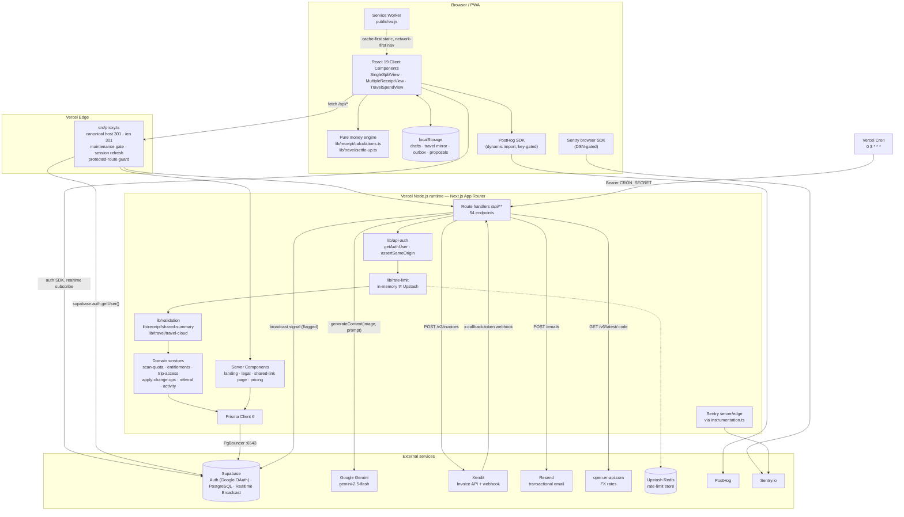
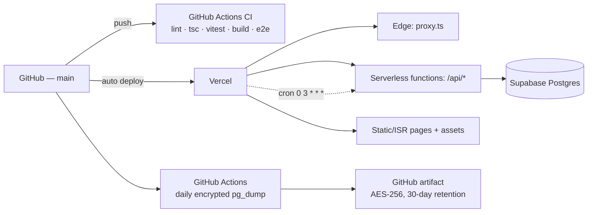

# Splitzy — System Architecture

> Evidence labels: **[IMPLEMENTED]** · **[INFERRED]** · **[ASSUMED]** · **[UNKNOWN]**

---

## 1. Architectural style

**[IMPLEMENTED]** Splitzy is a **single-deployable Next.js App Router monolith** on Vercel with one
primary datastore (Supabase PostgreSQL). There is no separate backend service, no message queue,
and no microservices. All server logic lives in App Router **route handlers** under
`src/app/api/**/route.ts`.

**[IMPLEMENTED]** The defining characteristic is a **local-first client** with an *optional* server:

- Single and Multiple modes work entirely in `localStorage`. The server is touched only when the
  user explicitly presses **Save**, or shares a link, or scans a receipt.
- Travel Spend is local-first for guests and **cloud-synced with a durable outbox** for signed-in
  users, so a receipt entered on flaky restaurant Wi-Fi is never lost.

Evidence: [src/hooks/useSaveSplit.ts](../../src/hooks/useSaveSplit.ts) (*"These modes stay
local-first: localStorage remains the working state and the server is touched only when the user
presses Save"*), [src/hooks/useTravelData.ts](../../src/hooks/useTravelData.ts),
[src/lib/travel/travel-outbox.ts](../../src/lib/travel/travel-outbox.ts).

**[INFERRED]** This shape is deliberate and product-driven: the app must be usable by a guest with
no account, offline, standing at a restaurant table. Authentication buys sync and history, not
basic function.

---

## 2. Layer diagram



---

## 3. Layers in detail

### 3.1 Edge layer — `src/proxy.ts` **[IMPLEMENTED]**

Runs on every non-asset request. `matcher` excludes `/api`, `_next/static`, `_next/image`,
`favicon.ico`, `*.png`, `*.svg` — **API routes are deliberately not proxied**, so each handler does
its own auth.

Ordered responsibilities:

1. **Canonical host** — exact-match `splitzy.my.id` → `301 https://www.splitzy.my.id`. Uses string
   equality rather than a `has: [{ type: "host" }]` rule in `next.config.mjs` because a pattern that
   also matched `www.` would loop forever.
2. **Legacy `/en/*` → un-prefixed** `301`. English used to live at `/en`; those URLs were already in
   Search Console.
3. **Maintenance gate** — `MAINTENANCE_MODE === "true"` redirects everything to `/maintenance`, and
   redirects `/maintenance` back to `/` when off.
4. **Supabase session refresh** — required by `@supabase/ssr`; writes refreshed cookies onto the
   response.
5. **Protected routes** — `/multiple` and `/history` require a user. A `getUser()` failure that is
   *not* a 401 lets the request through rather than false-redirecting a signed-in user; refreshed
   cookies are copied onto the redirect so no loop occurs.

### 3.2 Frontend layer

See [frontend.md](./frontend.md). Summary: of 28 `.tsx` files under `app/`, 20 are Server
Components (marketing, legal, tool wrappers, the shared-link page) and 8 are Client Components,
plus 40 client components under `src/components/`. The money engine is a **pure TypeScript
module with no React and no I/O**, which is why it can be unit-tested exhaustively and reused by the
share page, the history detail page and the editors alike.

### 3.3 Backend layer

See [backend.md](./backend.md). Summary: 40 route-handler files exposing 54 endpoints, with a
consistent middleware-by-convention pipeline:

```
assertSameOrigin (CSRF)  →  getAuthUser  →  enforceRateLimit  →  validate  →  authorize  →  Prisma  →  apiError/NextResponse
```

### 3.4 Domain / business-logic layer **[IMPLEMENTED]**

Pure or near-pure modules under `src/lib`, deliberately kept out of both routes and components:

| Module | Responsibility |
|---|---|
| `receipt/calculations.ts` | Item shares, tax/service/fee allocation, discount credits, per-receipt balances, `minimizeTransactions`, trip totals, FX normalisation |
| `travel/settle-up.ts` | Ledger semantics: share-payment source keys, `pairSettlement`, double-settle prevention |
| `travel/change-ops.ts` | Change-request op vocabulary + client-side overlay |
| `travel/apply-change-ops.ts` | Turns approved ops into an array of Prisma writes |
| `travel/trip-access.ts` | Trip authorization (`owner` vs `member`) |
| `billing/entitlements.ts` | `isProActive`, `extendProExpiry` |
| `scan-quota.ts` | Monthly AI-scan window and counter |
| `validation.ts`, `receipt/shared-summary.ts`, `receipt/saved-splits.ts`, `travel/travel-cloud.ts` | Runtime validators for untrusted bodies |
| `admin/admin-auth.ts`, `admin/admin-audit.ts` | Admin gate + audit vocabulary |
| `activity.ts` / `activity-server.ts` / `activity-client.ts` | Usage telemetry, split so Prisma never reaches the client bundle |

**[INFERRED]** The split of `activity.ts` (pure) / `-server.ts` (Prisma) / `-client.ts` (fetch
beacon) is a bundle-safety pattern applied consistently across the codebase.

### 3.5 Data layer **[IMPLEMENTED]**

- Single `PrismaClient` singleton, cached on `globalThis` outside production to survive HMR.
  [src/lib/prisma.ts](../../src/lib/prisma.ts)
- 15 models. Two storage strategies coexist:
  - **Relational** — `Receipt` + `ReceiptItem` + `ItemAssignment` (legacy; `ItemAssignment.userId`
    is an FK to `users`, so it can only express "an account holder consumed this").
  - **JSON payload** — `Receipt.payloadJson` and `TripReceipt.payload` hold the complete client
    `Receipt` shape. This is the authoritative representation, because a real split is between
    arbitrary *named* people who mostly have no account.
- Soft delete on `Trip` and `Receipt` (`deletedAt`), with manual cascade (Postgres `ON DELETE
  CASCADE` does not fire on an UPDATE).
- Optimistic concurrency via an integer `version` on `Trip` and `Receipt`, enforced with
  `UPDATE … WHERE id = ? AND version = ?` and surfaced as `409 VERSION_CONFLICT`.

See [../database/data-model.md](../database/data-model.md).

### 3.6 External services

See [integrations.md](./integrations.md).

---

## 4. Cross-cutting concerns

### 4.1 Security headers **[IMPLEMENTED]**

Set for `/:path*` in [next.config.mjs](../../next.config.mjs):

| Header | Value | Note |
|---|---|---|
| `Content-Security-Policy-Report-Only` | full directive set | **report-only** on purpose — flip the header name to enforce once the report stream is clean |
| `Strict-Transport-Security` | `max-age=31536000` | no `includeSubDomains`/`preload` yet, to stay reversible |
| `X-Content-Type-Options` | `nosniff` | |
| `X-Frame-Options` | `SAMEORIGIN` | mirrored by CSP `frame-ancestors` |
| `Referrer-Policy` | `strict-origin-when-cross-origin` | |
| `Permissions-Policy` | `camera=(), microphone=(), geolocation=(), browsing-topics=()` | camera is denied because receipt capture uses `<input capture="environment">`, which needs no permission |

Additionally `/api/:path*` carries `X-API-Version: 1`. The literal duplicates `API_VERSION` in
[src/lib/api-version.ts](../../src/lib/api-version.ts) and must be bumped together — the config is
`.mjs` and loads before any TypeScript transform.

CSP allowlist: Google Fonts, `lh3.googleusercontent.com` (Google avatars), `*.supabase.co` +
`wss://*.supabase.co`, `accounts.google.com`. `'unsafe-inline'`/`'unsafe-eval'` remain because Next
emits inline bootstrap scripts.

### 4.2 Rate limiting **[IMPLEMENTED]**

Two implementations behind one interface:

- **In-memory sliding window** ([src/lib/rate-limit.ts](../../src/lib/rate-limit.ts)) — per-instance,
  map capped at 10 000 buckets (cleared wholesale when full). Explicitly documented as best-effort.
- **Upstash Redis sorted set** ([src/lib/rate-limit-redis.ts](../../src/lib/rate-limit-redis.ts)) —
  one pipelined round-trip does trim → add → count → TTL → oldest-entry. Behind
  `FLAG_DISTRIBUTED_RATE_LIMIT`, **fails open** to in-memory on any error.

Keys are layered: `"<scope>:u:<userId>"` when authenticated, `"<scope>:ip:<x-forwarded-for>"` when
not. They are deliberately not AND-ed — a user behind shared NAT should not be capped by neighbours.

Only two call sites use the async (Redis-capable) variant: `parse-receipt` and `billing/checkout`.
Everything else uses the sync in-memory one. **[IMPLEMENTED]**

### 4.3 Error contract **[IMPLEMENTED]**

Every error response is `{ error: string, code: ErrorCode, ...context }`, produced by `apiError()`.
`code` is the stable machine-readable identifier clients branch on. Status mapping lives in one
table in [src/lib/api-response.ts](../../src/lib/api-response.ts). See
[../api/api-overview.md](../api/api-overview.md#error-contract).

### 4.4 Observability **[IMPLEMENTED]**

- `instrumentation.ts` registers the Sentry server or edge config per runtime and exports
  `onRequestError` to forward uncaught route-handler / RSC errors.
- `instrumentation-client.ts` initialises the browser SDK and exports
  `onRouterTransitionStart` for App Router navigation instrumentation.
- `GET /api/health` is a liveness+readiness probe: `SELECT 1`, returns 200/503 with latency, uptime,
  commit SHA and region, `Cache-Control: no-store`.

### 4.5 Realtime **[IMPLEMENTED]**

Behind `NEXT_PUBLIC_FLAG_REALTIME`. After a successful trip mutation the server POSTs a **signal
only** (no trip data) to Supabase's stateless HTTP broadcast endpoint on channel `trip:<tripId>`,
carrying `{ v, tripId, kind, actorId, version }`. Subscribed clients refetch through the normal
authenticated API, so authorization is unchanged and nothing sensitive rides the broadcast.
Fire-and-forget: every error is swallowed.
Evidence: [src/lib/realtime.ts](../../src/lib/realtime.ts).

---

## 5. Runtime selection **[IMPLEMENTED]**

| Surface | Runtime | Why |
|---|---|---|
| `src/proxy.ts` | Edge (default) | Cheap redirects + cookie refresh |
| Most `/api/*` handlers | Node.js — many declare `export const runtime = "nodejs"` explicitly | Prisma cannot open Postgres connections from Edge |
| `/api/health` | `runtime = "nodejs"`, `dynamic = "force-dynamic"` | DB probe must be fresh |
| `/api/parse-receipt` | Node.js, `maxDuration = 60` | Vision calls exceed the default budget |
| `/s/[code]` page | `dynamic = "force-dynamic"` | Per-request user data, never cached |
| `/single`, `/multiple`, `/travel` | Static (`○`) | Client views wrapped in `Suspense` so `useSearchParams` does not force them dynamic |

**[IMPLEMENTED]** Keeping the three tool pages statically prerenderable is an explicit constraint —
`src/lib/i18n/use-locale.ts` documents that reading a locale cookie server-side was rejected
precisely because it would turn those routes dynamic.

---

## 6. Deployment topology



**[IMPLEMENTED]** CI is a quality gate only; Vercel deploys independently from `main`.
**[INFERRED]** Because CI is not a deployment gate, a red CI run does not block a production deploy.

---

## 7. Architectural constraints observed in code

| Constraint | Consequence | Evidence |
|---|---|---|
| Supabase **free tier**, no managed backups | Owned daily encrypted `pg_dump` workflow | [backup.yml](../../.github/workflows/backup.yml), [DISASTER_RECOVERY.md](../DISASTER_RECOVERY.md) |
| PgBouncer transaction pooling | No interactive `$transaction`; array form only | [apply-change-ops.ts](../../src/lib/travel/apply-change-ops.ts) |
| `prisma db push` blocked in the dev sandbox | Hand-written additive SQL in `prisma/sql/`, applied via the Supabase SQL editor | every file in [prisma/sql/](../../prisma/sql/) |
| Serverless multi-instance | In-memory rate limiter is per-instance; Upstash exists as the fix, flagged off | [rate-limit.ts](../../src/lib/rate-limit.ts) |
| Contested brand name "Splitzy" | Heavy investment in entity JSON-LD, hreflang, canonical hygiene, and E2E SEO regression tests | [structured-data.ts](../../src/lib/seo/structured-data.ts), [e2e/smoke.spec.ts](../../e2e/smoke.spec.ts) |
| Tool pages must stay statically prerendered | Locale is a client-side preference, not a server cookie | [use-locale.ts](../../src/lib/i18n/use-locale.ts) |

---

## 8. Confidence and unknowns

| Item | Label |
|---|---|
| Layer boundaries, request pipeline, service inventory | **[IMPLEMENTED]** — read directly from source |
| Supabase RLS posture on any table | **[UNKNOWN]** — no policy SQL in the repo; authorization is enforced entirely in application code |
| Whether `/api/admin/cleanup` is scheduled | **[UNKNOWN]** — only `/api/cron/expire-pro` is in `vercel.json` |
| Actual production flag values | **[UNKNOWN]** — set in the Vercel dashboard, not in the repo. A comment in [sitemap.ts](../../src/app/sitemap.ts) says `pricingPage` "is currently on in production" |
| Whether Vercel Preview points at a separate Supabase project | **[UNKNOWN]** — [ENVIRONMENT_ISOLATION.md](../ENVIRONMENT_ISOLATION.md) records that staging was deferred and work proceeds "prod-direct" with additive-only migrations |
