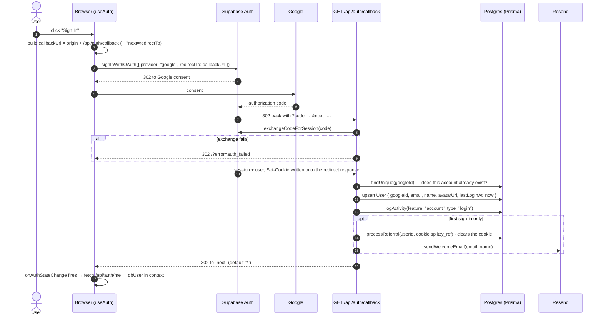

# Splitzy — Authentication

> Evidence labels: **[IMPLEMENTED]** · **[INFERRED]** · **[ASSUMED]** · **[UNKNOWN]**

---

## 1. Provider **[IMPLEMENTED]**

**Supabase Auth**, using `@supabase/supabase-js ^2.103.0` and `@supabase/ssr ^0.10.2`.
The application maintains its **own** `User` table in the same PostgreSQL database, linked to the
Supabase identity by `User.googleId = <supabase auth user id>` (a `@unique` column).

Three Supabase client factories exist, one per execution context:

| Context | Factory | File |
|---|---|---|
| Browser | `createBrowserClient` | [src/lib/supabase/client.ts](../../src/lib/supabase/client.ts) |
| Server Component / route handler with `cookies()` | `createServerClient` over `next/headers` | [src/lib/supabase/server.ts](../../src/lib/supabase/server.ts) |
| Edge proxy + `getAuthUser` | `createServerClient` over the raw request cookies | [src/proxy.ts](../../src/proxy.ts), [src/lib/api-auth.ts](../../src/lib/api-auth.ts) |

The server factory swallows errors from `cookieStore.set()` because a Server Component cannot write
cookies — session refresh is the proxy's job.

---

## 2. Supported methods **[IMPLEMENTED]**

| Method | Status |
|---|---|
| **Google OAuth** | The only method. `supabase.auth.signInWithOAuth({ provider: "google" })` |
| Email/password | **Not implemented** — no `signUp`, `signInWithPassword`, or `resetPasswordForEmail` call exists anywhere |
| Magic link / OTP | **Not implemented** |
| Other OAuth providers | **Not implemented** |

Verified by grepping `supabase.auth.*` across `src/`: only `getUser`, `onAuthStateChange`,
`signInWithOAuth`, `signOut`, and `exchangeCodeForSession` are used.

**[IMPLEMENTED]** There is therefore **no sign-up flow distinct from sign-in, and no password reset
flow**. "Sign up" is the first successful Google sign-in, which upserts a `User` row.

---

## 3. Sign-in flow **[IMPLEMENTED]**

Details worth noting:

- **`next` parameter** — `signIn(redirectTo)` sets `?next=<path>` on the callback URL, so the user
  lands where they were going. Used by `/history`, `/history/[id]`, `/invite/[token]`, `/admin`,
  and `UpgradeButton`.
- **Name and avatar** fall back across Google's metadata keys:
  `full_name ?? name` and `avatar_url ?? picture`.
- **First sign-in detection** is a pre-`upsert` `findUnique` on `googleId`, which is what gates the
  referral credit and the welcome email so neither can fire twice.
- **A DB failure does not block login.** The upsert is wrapped in `try/catch` that only logs:
  the Supabase session is already valid, so the user is signed in even if the profile write failed.
  **[INFERRED]** consequence: such a user has a session but no `User` row, and `getAuthUser`
  returns `null` for them — every protected API call 401s until a later sign-in repairs the row.
- **`?error=no_code`** when the callback is hit without a code.

---

## 4. Session handling **[IMPLEMENTED]**

- **Storage**: HTTP cookies written by `@supabase/ssr` (JWT access token + refresh token). The app
  never touches the token values directly and never stores a token in `localStorage`.
- **`SameSite=Lax`** is set by the Supabase SSR helper; the app's `assertSameOrigin` check is
  described as working "in concert" with it.
- **Refresh**: performed in the edge proxy on every matched navigation. `createServerClient`'s
  `setAll` callback re-creates the response and copies refreshed cookies onto it. When the proxy
  needs to redirect an unauthenticated user, it explicitly copies those refreshed cookies onto the
  redirect response too — *"prevents a second redirect loop"*.
- **Client sync**: `useAuthProvider` calls `supabase.auth.getUser()` once on mount and subscribes to
  `onAuthStateChange`; the subscription is unsubscribed on unmount.
- **Expiry UX**: `AuthProvider` compares the previous and current authenticated state and fires a
  "Signed out — sign in again to access your data" toast on a transition to signed-out. It skips the
  first resolution after mount so a never-logged-in visitor is not told they were signed out.

**[UNKNOWN]** Token lifetime and refresh cadence are Supabase project settings, not visible in the
repo.

---

## 5. Sign-out flow **[IMPLEMENTED]**

`signOut()` in [src/hooks/useAuth.ts](../../src/hooks/useAuth.ts):

1. `await supabase.auth.signOut()` — clears the session cookies.
2. Purges app-owned `localStorage`, so the next person on a shared device inherits nothing:
   `splitbill-single`, `splitbill-trips`, `splitzy-history`, `splitzy-guest-splits-count`,
   `splitzy-travel-mirror`, `splitzy-travel-outbox`, `splitzy-travel-draft`.
   Wrapped in `try/catch` because storage may be unavailable.
3. Clears `user` and `dbUser` in context.

**[IMPLEMENTED]** `splitzy-travel` (the *guest* store) and `splitzy-locale` are intentionally not
cleared — the former is guest-scoped, the latter is a preference rather than data.

---

## 6. `GET /api/auth/me` **[IMPLEMENTED]**

The bridge between the Supabase identity and the app profile.

- Resolves the Supabase user from cookies, then the Prisma `User` by `googleId`.
- `401 { user: null }` when there is no session; `404 { user: null }` when the session is valid but
  no `User` row exists.
- On success returns `{ id, email, name, avatarUrl, createdAt, isAdmin }`.
- The raw `role` column is destructured away and **never leaves the server** — the UI only needs the
  boolean. `isAdmin` is computed with `isAdmin({ email, role })`, so a bootstrap-allowlist admin is
  reflected even when the DB column says `"user"`.

Note: this handler does **not** apply the `bannedAt` guard that `getAuthUser` applies, so a banned
user still receives their profile from `/api/auth/me` even though every other protected endpoint
401s. **[IMPLEMENTED]**

---

## 7. Protected routes **[IMPLEMENTED]**

### 7.1 Proxy-enforced (server-side)

`protectedPaths = ["/multiple", "/history"]` in [src/proxy.ts](../../src/proxy.ts). Matching is
`startsWith`, so `/history/<id>` is covered. Unauthenticated requests are redirected to
`/?login=required&redirect=<pathname>`.

> ⚠️ **Corrected in Phase C.** In practice this redirect **never fires for anonymous users**:
> `AuthSessionMissingError` carries status **400**, not 401, so the failure-tolerant branch below
> admits every session-less request. `/history` is saved by its own page-level gate; `/multiple` is
> not. See [../ux/ux-audit.md](../ux/ux-audit.md) UX-001.

**Failure-tolerant guard**: if `supabase.auth.getUser()` returns an error whose status is *not* 401
(a transient network/service fault), the request is allowed through rather than false-redirecting a
signed-in user. The page-level check then catches genuinely anonymous requests.

### 7.2 Page-level (client-side)

| Surface | Behaviour when signed out |
|---|---|
| `/history` | Renders an in-page sign-in gate rather than bouncing — keeps the user on the page with a clear reason |
| `/history/[id]` | `router.replace("/?login=required&redirect=/history/<id>")` |
| `/admin` | `router.replace("/?login=required&redirect=/admin")` |
| `UpgradeButton` | `window.location.href = "/?login=required&redirect=/pricing"` |
| `/invite/[token]` | Join button calls `signIn("/invite/<token>")` instead of joining |

### 7.3 The `?login=required` convention **[IMPLEMENTED]**

`LoginBanner` (a client island inside the otherwise-server landing page) reads
`?login=required` and `?redirect=<path>`, and renders a sign-in prompt above the hero. The copy is
deliberately generic — it previously said "Sign in to view your Receipt History" for every caller,
including the pricing bounce, and was therefore wrong for at least one of them.

### 7.4 API-level

Every protected route handler calls `getAuthUser(request)` itself, because the proxy matcher
excludes `/api`. See [backend.md](./backend.md#4-authentication-in-handlers).

---

## 8. Guest access **[IMPLEMENTED]**

Authentication is optional by design.

| Capability | Guest | Signed-in |
|---|---|---|
| `/single` split | ✅ (capped at `MAX_GUEST_SPLITS = 3`, then a sign-in prompt) | ✅ unlimited |
| `/multiple` | ❌ proxy-redirected | ✅ |
| `/travel` | ✅ localStorage only | ✅ cloud-synced, collaborative |
| AI receipt scan | ✅ — quota is only enforced for authenticated users | ✅ 15/month free, unlimited on Pro |
| Create a share link (`POST /api/share`) | ✅ (`createdById` stays null) | ✅ |
| View `/s/<code>` and `/share#…` | ✅ | ✅ |
| Save/resume a split, history, dashboard, referrals, Pro | ❌ | ✅ |

**[IMPLEMENTED]** The AI scan quota gap is explicit in
[parse-receipt/route.ts:99-110](../../src/app/api/parse-receipt/route.ts#L99-L110): *"Monthly AI
scan quota — only enforced for authenticated users."* Guests are bounded only by the IP rate limit
of 10 scans/minute.
**[INFERRED]** This is a deliberate acquisition trade-off (let people try it) that carries a real
Gemini cost exposure for anonymous traffic.

---

## 9. Referral capture **[IMPLEMENTED]**

Referrals ride the sign-up path:

1. `RefCapture` (mounted in the root layout inside `Suspense`) reads `?ref=CODE` from any URL. It
   validates `^[A-Z0-9]{6,10}$` and writes `document.cookie = "splitzy_ref=CODE; path=/;
   max-age=2592000; SameSite=Lax"` (30 days).
2. On **first** sign-in only, the auth callback reads that cookie, calls
   `processReferral(newUserId, code)`, and expires the cookie.
3. `processReferral` finds the referrer by `referralCode`, refuses self-referral, creates a
   `Referral` row, and extends the referrer's Pro by `REFERRAL_REWARD_DAYS = 14`. The unique
   constraint on `referee_id` makes a double claim a silent no-op.

Note the format mismatch: codes are generated from the alphabet
`ABCDEFGHJKLMNPQRSTUVWXYZ23456789` at length 8, which satisfies the capture regex — but the regex is
broader than the generator. **[IMPLEMENTED]**

---

## 10. Ban enforcement **[IMPLEMENTED]**

`User.bannedAt` is set by an admin. `getAuthUser` returns `null` when it is non-null, so a banned
user is treated as unauthenticated by every route handler that uses it. The proxy does **not** check
`bannedAt` — a banned user can still load `/multiple` and `/history` shells, but every API call
inside them 401s.

---

## 11. Security posture summary

| Control | State | Evidence |
|---|---|---|
| Tokens in httpOnly cookies, never `localStorage` | ✅ | `@supabase/ssr` defaults |
| CSRF: `SameSite=Lax` + explicit `Origin`/`Referer` allowlist on mutations | ✅ | `assertSameOrigin` |
| Session refresh at the edge, cookies propagated across redirects | ✅ | `src/proxy.ts` |
| Banned users rejected at the auth boundary | ✅ | `api-auth.ts` |
| Per-request auth memoisation | ✅ | React `cache()` |
| HSTS, `nosniff`, `X-Frame-Options`, `Referrer-Policy` | ✅ | `next.config.mjs` |
| CSP | ⚠️ report-only, with `'unsafe-inline'`/`'unsafe-eval'` | `next.config.mjs` |
| `/api/auth/me` does not apply the ban guard | ⚠️ | `api/auth/me/route.ts` |
| Supabase RLS as defence in depth | **[UNKNOWN]** | no policy SQL in the repo |
| MFA / step-up auth | ❌ not implemented | — |
| Session revocation on ban (existing cookies stay valid until expiry) | ❌ | ban is enforced at read time only |

---

## 12. Open questions

| # | Question | Label |
|---|---|---|
| 1 | Are Supabase RLS policies enabled on any table? Application code is currently the only authorization layer | **[UNKNOWN]** |
| 2 | What are the configured access/refresh token lifetimes in the Supabase project? | **[UNKNOWN]** |
| 3 | Should `/api/auth/me` reject banned users for consistency with `getAuthUser`? | **[UNKNOWN]** — behavioural gap, intent unclear |
| 4 | Is the unmetered guest AI-scan path an accepted cost, or an oversight? | **[UNKNOWN]** |
