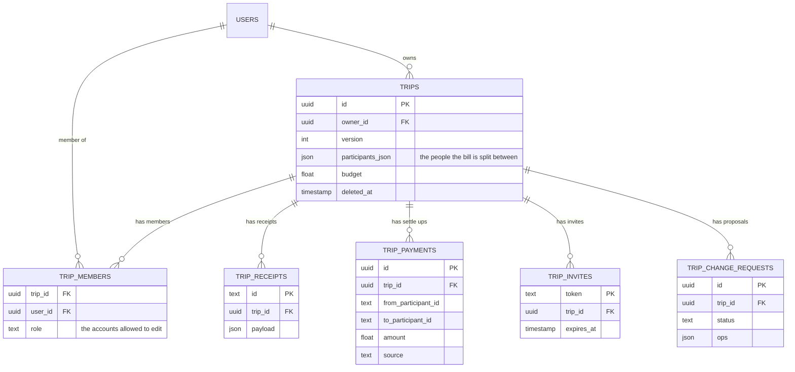
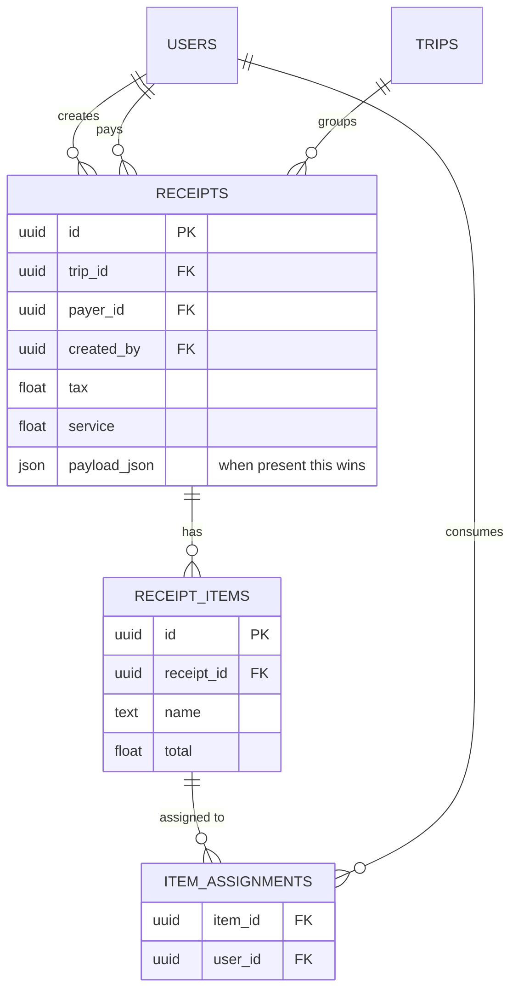
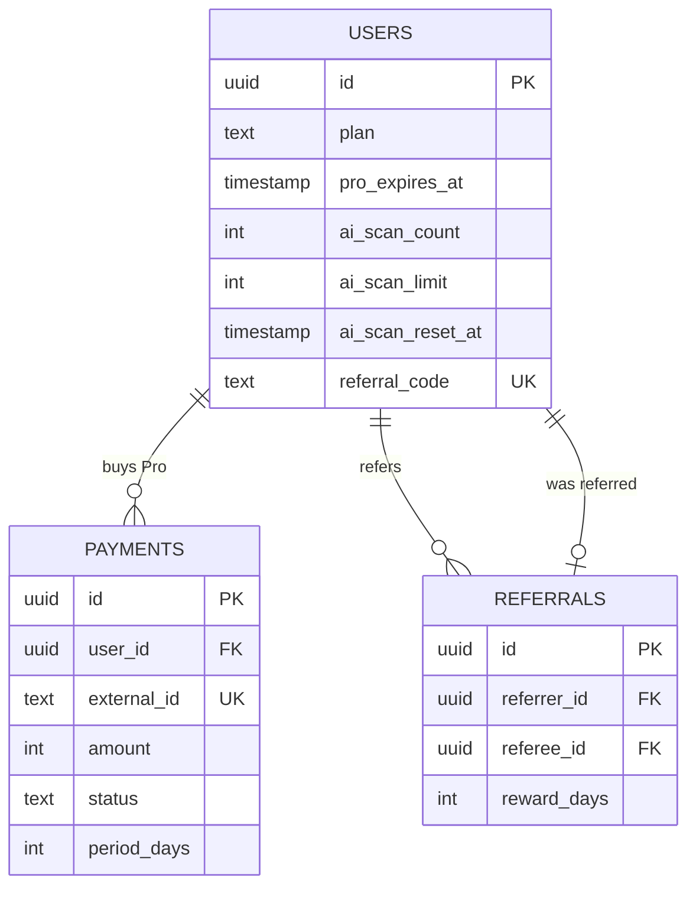
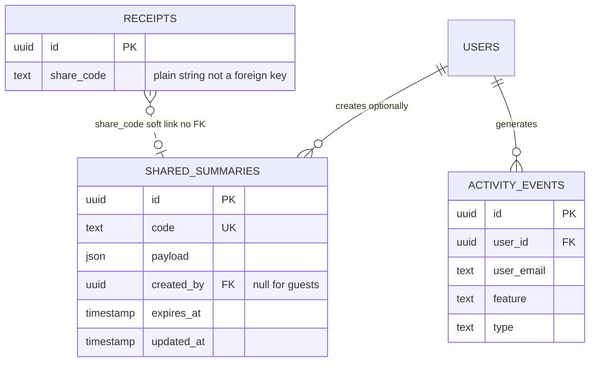
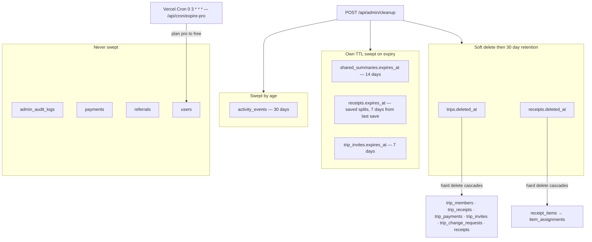

# Splitzy — Entity Relationship Diagrams

> Generated from [prisma/schema.prisma](../../prisma/schema.prisma). All 15 models.
> Evidence: **[IMPLEMENTED]** — every relationship shown is declared in the schema.
>
> Diagrams use Mermaid `erDiagram`. Field lists are abbreviated to keys, foreign keys and the
> columns that carry business meaning; the exhaustive column lists are in
> [entities.md](./entities.md).

---

## 1. Full ERD

```mermaid
erDiagram
    USERS ||--o{ PAYMENTS : "purchases Pro via"
    USERS ||--o{ REFERRALS : "refers as referrer"
    USERS ||--o| REFERRALS : "was referred as referee"
    USERS ||--o{ TRIPS : "owns"
    USERS ||--o{ TRIP_MEMBERS : "joins trips through"
    USERS ||--o{ RECEIPTS : "creates"
    USERS ||--o{ RECEIPTS : "is recorded payer of"
    USERS ||--o{ ITEM_ASSIGNMENTS : "consumes items through"
    USERS ||--o{ SHARED_SUMMARIES : "creates optionally"
    USERS ||--o{ ACTIVITY_EVENTS : "generates"

    TRIPS ||--o{ TRIP_MEMBERS : "grants access through"
    TRIPS ||--o{ TRIP_RECEIPTS : "contains json receipts"
    TRIPS ||--o{ TRIP_PAYMENTS : "settles through ledger"
    TRIPS ||--o{ TRIP_INVITES : "issues"
    TRIPS ||--o{ TRIP_CHANGE_REQUESTS : "reviews"
    TRIPS ||--o{ RECEIPTS : "contains legacy receipts"

    RECEIPTS ||--o{ RECEIPT_ITEMS : "itemised as"
    RECEIPT_ITEMS ||--o{ ITEM_ASSIGNMENTS : "assigned via"

    USERS {
        uuid id PK
        text email UK
        text google_id UK "supabase auth id"
        text name
        text avatar_url
        text plan "free or pro"
        int ai_scan_count
        timestamp ai_scan_reset_at
        int ai_scan_limit "null uses plan default"
        timestamp pro_expires_at "null never expires"
        text referral_code UK
        timestamp banned_at "non null blocks access"
        text role "user or admin"
        timestamp last_login_at
        timestamp created_at
        timestamp updated_at
    }

    PAYMENTS {
        uuid id PK
        uuid user_id FK
        text external_id UK "our idempotency key"
        text xendit_id UK
        int amount "whole rupiah"
        text currency
        text status "pending paid expired failed"
        text plan
        int period_days
        text invoice_url
        timestamp paid_at
        timestamp created_at
        timestamp updated_at
    }

    REFERRALS {
        uuid id PK
        uuid referrer_id FK
        uuid referee_id FK "unique one referral per user"
        timestamp created_at
        timestamp rewarded_at
        int reward_days
    }

    TRIPS {
        uuid id PK
        text name
        uuid owner_id FK
        int version "optimistic lock"
        timestamp deleted_at "soft delete"
        float budget
        json participants_json "name based participants"
        timestamp created_at
        timestamp updated_at
    }

    TRIP_MEMBERS {
        uuid id PK
        uuid trip_id FK
        uuid user_id FK
        text role "owner or member"
        timestamp joined_at
    }

    TRIP_RECEIPTS {
        text id PK "client generated equals receipt id"
        uuid trip_id FK
        json payload "full client receipt"
        int sort_order
        uuid created_by "no fk constraint"
        timestamp created_at
        timestamp updated_at
    }

    TRIP_PAYMENTS {
        uuid id PK
        uuid trip_id FK
        text from_participant_id "participant namespace"
        text to_participant_id "participant namespace"
        float amount "native currency"
        text currency "null means IDR"
        float fx_rate "locked at creation"
        text note
        text source "null manual or share prefix"
        uuid created_by "no fk constraint"
        timestamp created_at
    }

    TRIP_INVITES {
        text token PK "the secret"
        uuid trip_id FK
        text role
        uuid created_by "no fk constraint"
        timestamp expires_at "7 day ttl"
        timestamp created_at
    }

    TRIP_CHANGE_REQUESTS {
        uuid id PK
        uuid trip_id FK
        uuid author_id "no fk constraint"
        text status "pending approved declined"
        int base_version
        json ops "serialized ChangeOp array"
        text note
        text review_note
        uuid reviewed_by "no fk constraint"
        timestamp created_at
        timestamp reviewed_at
    }

    RECEIPTS {
        uuid id PK
        uuid trip_id FK "null for saved splits"
        text title
        uuid payer_id FK "saved under this account"
        uuid created_by FK "grants write access"
        float tax "legacy column"
        float service "legacy column"
        timestamp date
        json participants_json
        json payload_json "authoritative split document"
        timestamp expires_at "saved split ttl 7 days"
        text share_code "no fk to shared summaries"
        int version "optimistic lock"
        timestamp deleted_at "soft delete"
        timestamp created_at
        timestamp updated_at
    }

    RECEIPT_ITEMS {
        uuid id PK
        uuid receipt_id FK
        text name
        int qty
        float unit_price
        float total
        int sort_order
    }

    ITEM_ASSIGNMENTS {
        uuid id PK
        uuid item_id FK
        uuid user_id FK "account holders only"
    }

    SHARED_SUMMARIES {
        uuid id PK
        text code UK "public short code"
        json payload "point in time snapshot"
        uuid created_by FK "null for guests set null on delete"
        timestamp expires_at "14 day ttl"
        timestamp created_at
        timestamp updated_at "when numbers last moved"
    }

    ACTIVITY_EVENTS {
        uuid id PK
        uuid user_id FK
        text user_email "denormalised snapshot"
        text feature "single multiple travel account"
        text type "login split created share created"
        json metadata
        timestamp created_at
    }

    ADMIN_AUDIT_LOGS {
        uuid id PK
        uuid actor_id "no fk survives deletion"
        text actor_email "snapshot"
        text action "plan change quota reset ban"
        uuid target_user_id "no fk"
        text target_email "snapshot"
        json metadata "before and after"
        timestamp created_at
    }
```

`ADMIN_AUDIT_LOGS` is drawn unconnected on purpose — it has **no foreign keys at all**, so the trail
survives account deletion.

---

## 2. Travel Spend cluster

The current, actively-used trip model.

Two distinct populations sit on one `TRIPS` row: `participants_json` (who the bill is split between,
name-based) and `TRIP_MEMBERS` (which accounts may edit). They never join.

---

## 3. Legacy relational receipt cluster

Retained for rows written before `payload_json` existed. Not used by the shipped UI.

**The structural limitation this cluster has and cannot escape:** `ITEM_ASSIGNMENTS.user_id` is a
foreign key to `USERS`, so it can only record that *an account holder* consumed an item. A real
split is between arbitrary named people who mostly have no account — which is why
`RECEIPTS.payload_json` was added and now takes precedence whenever it is present.

---

## 4. Billing and growth cluster

Both paths converge on the same two columns — a paid invoice and a successful referral each call
`extendProExpiry` and write `plan = "pro"` with a new `pro_expires_at`.

---

## 5. Sharing and telemetry

`RECEIPTS.share_code → SHARED_SUMMARIES.code` is drawn dotted because it is **not** a foreign key.
It is deliberately allowed to dangle: the summary expires after 14 days while the receipt may live
longer, and `updateMany` matching zero rows is a harmless no-op.

---

## 6. Lifecycle overview

Not an ERD — how rows leave the system.

**[IMPLEMENTED]** Only `/api/cron/expire-pro` appears in [vercel.json](../../vercel.json).
**[UNKNOWN]** whether `/api/admin/cleanup` is scheduled anywhere — if it is not, none of the
retention arrows above are actually firing.

---

*See also: [entities.md](./entities.md) · [relationships.md](./relationships.md) ·
[data-model.md](./data-model.md)*
