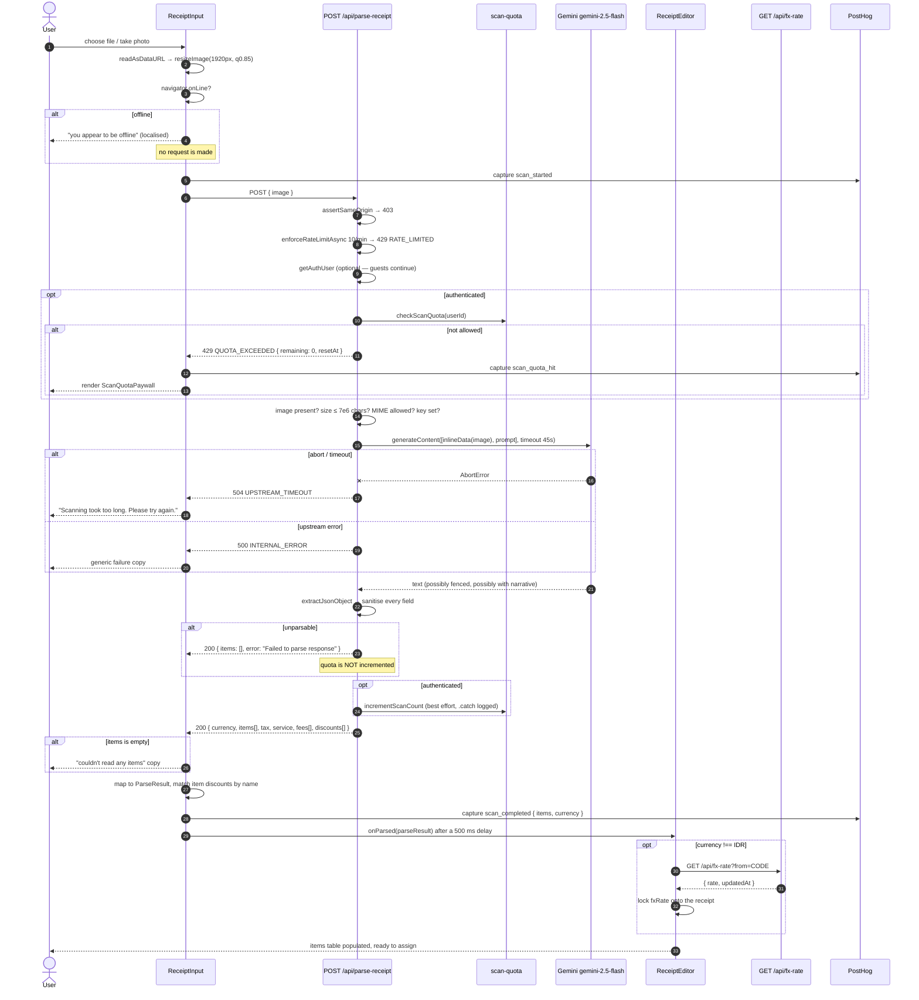
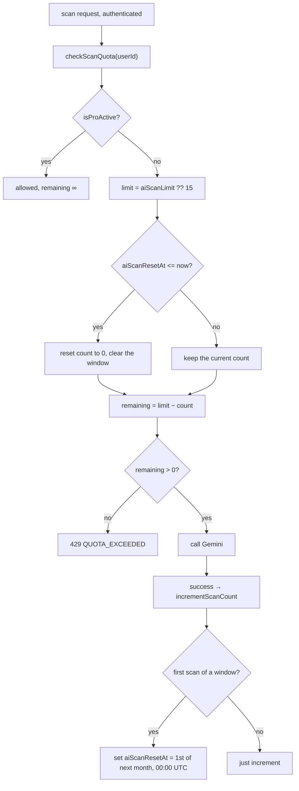

# Flow — AI Receipt Scan

> Camera or upload → Gemini → parsed fields → a populated editor.
> Configuration-level detail (the full prompt, cost controls, quota mechanics) is in
> [../architecture/ai-integration.md](../architecture/ai-integration.md); this document traces the
> runtime path.
>
> Evidence labels: **[IMPLEMENTED]** · **[INFERRED]** · **[ASSUMED]** · **[UNKNOWN]**

---

## 1. Layered pipeline

```
User
 ↓  taps "Scan receipt" or "Upload photo"
ReceiptInput  (<input type="file" accept="image/*" [capture="environment"]>)
 ↓  FileReader.readAsDataURL → data URL
 ↓  resizeImage: <canvas>, longest edge ≤ 1920 px, JPEG q0.85
 ↓  navigator.onLine check  →  short-circuit with an offline message
 ↓  capture("scan_started")
POST /api/parse-receipt  { image: "data:image/jpeg;base64,…" }
 ↓  assertSameOrigin → rate limit 10/min → optional auth → quota (authenticated only)
 ↓  size / MIME / API-key checks
Gemini gemini-2.5-flash — generateContent([inlineData, prompt], { timeout: 45s })
 ↓  extractJsonObject: strip code fences, walk to the first balanced object
 ↓  sanitise every field: bounds, types, caps, coercions
 ↓  incrementScanCount (best effort)
Response { currency, items[], tax, service, fees[], discounts[] }
 ↓  ReceiptInput maps to ParseResult: generateId(), unitPrice = price / qty
 ↓  item-scope discounts matched itemName → item UUID, else downgraded to receipt scope
 ↓  capture("scan_completed", { items, currency })
onParsed(parseResult)  →  ReceiptEditor merges into the working Receipt
 ↓  non-IDR currency? → GET /api/fx-rate?from=CODE → lock fxRate onto the receipt
User assigns items to people
```

---

## 2. Sequence



---

## 3. Client preparation **[IMPLEMENTED]**

| Step | Detail |
|---|---|
| Input | `<input type="file" accept="image/*">`; the camera variant adds `capture="environment"` |
| Why no camera permission | A `capture` file input does not need one — which is why `Permissions-Policy: camera=()` is safe |
| Read | `FileReader.readAsDataURL` |
| Resize | `<canvas>`, longest edge capped at **1920 px**, re-encoded `image/jpeg` at **0.85**. Both `img.onerror` and a missing 2D context fall back to the original data URL |
| Offline check | `navigator.onLine` short-circuits **before** the request |
| Preview | The raw (pre-resize) data URL is shown to the user |

The offline check has a stated product reason: *"Restaurant Wi-Fi is the likeliest failure in this
whole flow, and it used to surface as 'Failed to process image. Please try again.' — which reads as
'your photo is bad'. People re-shoot a perfectly good receipt, twice, then give up and open the
calculator."*

---

## 4. Server guards, in order **[IMPLEMENTED]**

| # | Guard | Failure |
|---|---|---|
| 1 | `assertSameOrigin` | `403 FORBIDDEN` |
| 2 | `enforceRateLimitAsync(10 / 60 s)` | `429 RATE_LIMITED` + `Retry-After` |
| 3 | `getAuthUser` — **optional** | — |
| 4 | `checkScanQuota` — **authenticated only** | `429 QUOTA_EXCEEDED` `{ remaining: 0, resetAt }` |
| 5 | `body.image` is a string | `400 BAD_REQUEST` `{ field: "image" }` |
| 6 | `image.length ≤ 7_000_000` | `413 PAYLOAD_TOO_LARGE` |
| 7 | MIME matches `jpeg\|jpg\|png\|webp\|heic\|heif` | `415 UNSUPPORTED_MEDIA_TYPE` |
| 8 | `GEMINI_API_KEY` set | `500 INTERNAL_ERROR` |

**[IMPLEMENTED]** Guests skip step 4 entirely and are bounded only by step 2.

---

## 5. Response hardening **[IMPLEMENTED]**

The model's output is treated as **untrusted input**.

`extractJsonObject(text)`:

1. Strips ```` ```json … ``` ```` fences if present.
2. Walks from the first `{`, tracking `depth`, `inString` and `escape`, so braces inside string
   values do not confuse the matcher.
3. `JSON.parse` on the first balanced top-level object; any throw returns `null`.

Then every field is re-derived:

| Field | Hardening |
|---|---|
| `currency` | `/^[A-Z]{2,10}$/` after trim + uppercase, else `"IDR"` |
| `items` | `.slice(0, 200)`; name must be a non-empty trimmed string; price finite and `> 0` (parsed with `parseIndonesianPrice` for IDR, `parseFloat` otherwise); qty integer ≥ 1 clamped to ≤ 1000 |
| `tax`, `service` | Currency-aware parse; negatives and non-finite → `0` |
| `fees` | `.slice(0, 20)`; label required; amount finite and `> 0`; `splitMethod` coerced to `"equal"` unless exactly `"proportional"` |
| `discounts` | `.slice(0, 20)`; label required; `type` coerced to `"amount"` unless exactly `"percent"`; `value = Math.abs(...)` and `> 0`; **percent > 100 rejected**; `scope` coerced to `"receipt"` unless exactly `"item"`; `itemName` kept only for item scope |

---

## 6. Mapping into the editor **[IMPLEMENTED]**

```ts
items = geminiResult.items.map(item => ({
  id: generateId(),
  name: item.name,
  qty: item.qty,
  unitPrice: roundTo2(item.price / item.qty),   // the model returns a LINE total
  total: roundTo2(item.price),
  assignedToIds: [],                             // the user assigns these next
}));
```

**Item-discount name matching** — the model returns `itemName` (a string); the editor needs a UUID:

```ts
const nameLower = d.itemName.toLowerCase();
const match = items.find(i =>
  i.name.toLowerCase().includes(nameLower) || nameLower.includes(i.name.toLowerCase())
);
targetId = match?.id;
// no match  →  scope downgraded to "receipt", never dropped
```

**[INFERRED]** Bidirectional `includes` is lenient by design — the discount line rarely repeats the
item name verbatim. The downgrade-rather-than-drop fallback means a mismatch spreads the benefit
across everyone instead of losing it, which matches the prompt's own "when in doubt, use receipt"
rule.

**Currency** is only carried through when it is not `"IDR"`, since IDR is the implicit base.

**500 ms delay** before `onParsed` fires, so the success state is visible rather than flashing past.

---

## 7. FX rate lock **[IMPLEMENTED]**

A non-IDR detection triggers a lookup in `ReceiptEditor`:

```
GET /api/fx-rate?from=THB → { rate, currency, updatedAt }
```

The rate is written onto the receipt as `fxRate` and **locked** — a later rate change never
retroactively alters a settled split. On failure the user is told to *"Enter the rate manually."*
`needsFxRate()` flags a foreign receipt still lacking a usable rate, because such a receipt passes
through `receiptInBaseCurrency` untouched and its native amounts would land in IDR totals at 1:1.

---

## 8. Error handling, end to end **[IMPLEMENTED]**

| Condition | Server | Client sentinel | User-facing copy |
|---|---|---|---|
| Offline before sending | — | — | `t.offline` |
| Quota exhausted | `429 QUOTA_EXCEEDED` | `__QUOTA__` | `<ScanQuotaPaywall>` + `scan_quota_hit` |
| Gemini > 45 s | `504 UPSTREAM_TIMEOUT` | `__TIMEOUT__` | `t.timedOut` |
| Connection dropped mid-request | — | — | `t.dropped` |
| Model output unparsable | `200 { error }` | — | the error text |
| Zero items extracted | `200 { items: [] }` | — | `t.noItems` |
| Anything else | `500 INTERNAL_ERROR` | — | `t.failedGeneric` |

The timeout is a distinct code on purpose:

> *A timeout is transient and retrying usually works, so it gets its own code and message. Lumping
> it into INTERNAL_ERROR told the user their receipt was unreadable, which sent them off cropping a
> photo that was fine all along.*

`isAbortError()` matches **structurally** — `name === "AbortError" || name ===
"GoogleGenerativeAIAbortError"`, or a `/abort|timeout|timed out/i` message — rather than with
`instanceof` on a vendor class, so it keeps working if the SDK renames its error type.

**[IMPLEMENTED]** The client signals across the `fetch` boundary using two magic strings,
`__QUOTA__` and `__TIMEOUT__`, thrown as `Error` messages and matched on the way out. Functional,
but it duplicates the `code` field the response already carries.

---

## 9. Quota lifecycle **[IMPLEMENTED]**



**[IMPLEMENTED]** `checkScanQuota` and `incrementScanCount` are two separate statements, so the cap
is not strictly atomic — concurrent scans can exceed it by a small margin.

**[IMPLEMENTED]** Neither soft-failure path (unparsable output, non-array items) reaches
`incrementScanCount`, so an unusable scan does not consume quota.

---

## 10. Analytics **[IMPLEMENTED]**

| Event | Properties | Fired |
|---|---|---|
| `scan_started` | — | Before the fetch |
| `scan_completed` | `{ items, currency }` | On a successful parse |
| `scan_quota_hit` | — | On `QUOTA_EXCEEDED` |
| `upgrade_clicked` | `{ source: "scan_paywall" }` | Paywall CTA |

No prompt, response, image, or latency is logged anywhere. Failures reach `console.error` /
`console.warn` only. **[IMPLEMENTED]**

---

## 11. Privacy in this flow

| Data | Destination | Retention |
|---|---|---|
| Receipt image (resized) | Google Gemini API | Not stored by Splitzy. Google's retention **[UNKNOWN]** |
| Extracted items and amounts | The user's browser; the DB only if they save | Per the normal retention rules |
| User identity | **Not sent to Google** — no id, email, or app data accompanies the image | — |

**[IMPLEMENTED]** A disclosure **is** shown at the upload point, localised in both languages:
*"Your photo is sent to Google Gemini for parsing and is not stored by Splitzy. Avoid uploading
receipts with sensitive personal data."* Confirmed by rendering `/single?step=bill` during Phase C.
*(This corrects an error in the first draft of this document, which stated no disclosure existed.)*
**[UNKNOWN]** whether `/privacy` covers this — not verified line by line.

---

## 12. Observations

| # | Observation | Label |
|---|---|---|
| 1 | Guests bypass the monthly quota entirely; only the 10/min IP limit applies | **[IMPLEMENTED]** |
| 2 | No structured-output mode is requested, so the hand-rolled JSON extractor is load-bearing | **[IMPLEMENTED]** |
| 3 | No automatic retry on a transient Gemini failure | **[IMPLEMENTED]** |
| 4 | No confidence signal — "low confidence" is indistinguishable from "empty receipt" | **[IMPLEMENTED]** |
| 5 | Item-discount matching is a fuzzy substring test that can mis-target on similar item names | **[INFERRED]** |
| 6 | `__QUOTA__` / `__TIMEOUT__` magic strings duplicate the `code` already on the response | **[IMPLEMENTED]** |
| 7 | Quota check and increment are not atomic | **[IMPLEMENTED]** |
| 8 | A framing overlay on the camera view — to coach users to fill the frame — is not implemented; the prompt compensates in words instead | **[IMPLEMENTED]** absence |
