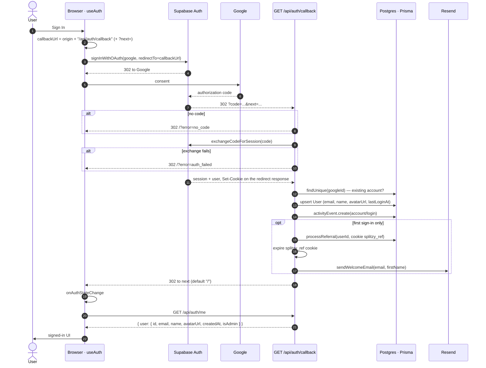
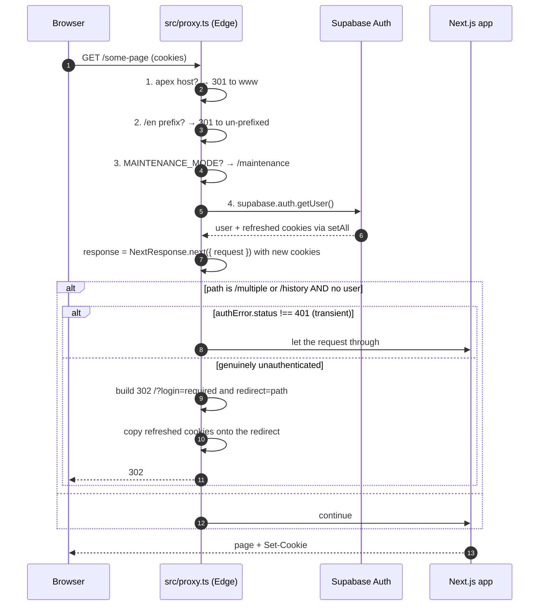
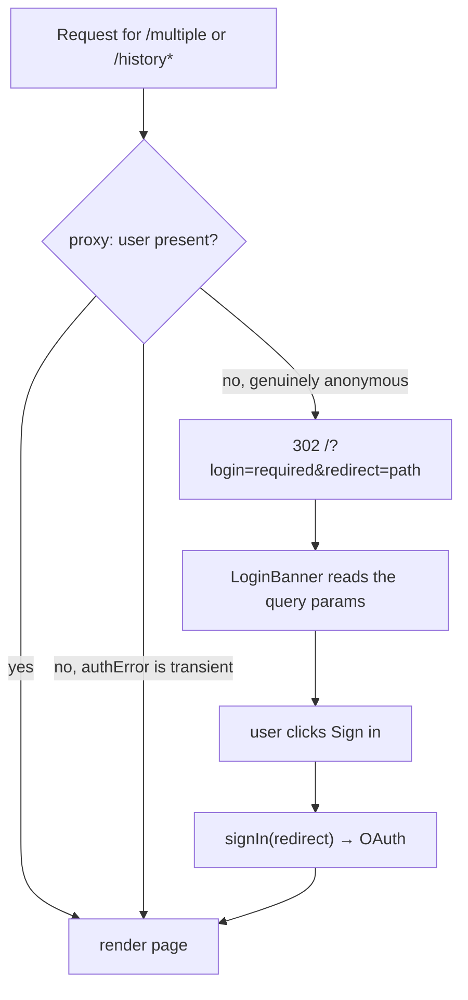
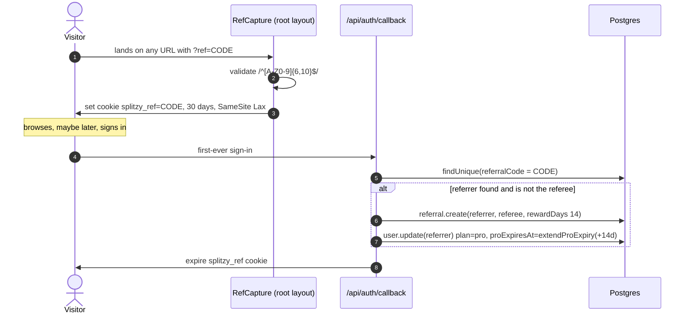

# Flow — Authentication

> Sign-up, sign-in, session refresh, sign-out, and the protected-route guard.
> Architecture-level detail is in [../architecture/authentication.md](../architecture/authentication.md);
> this document traces the runtime path.
>
> Evidence labels: **[IMPLEMENTED]** · **[INFERRED]** · **[ASSUMED]** · **[UNKNOWN]**

---

## 1. Sign-up = first sign-in **[IMPLEMENTED]**

There is no separate registration. Google OAuth is the only method; the first successful sign-in
upserts a `User` row and triggers the two first-run side effects (referral credit, welcome email).
There is no password anywhere, therefore no password-reset flow.

---

## 2. Layered pipeline

```
User
 ↓  clicks "Sign In"  (AuthButton / LoginBanner / history gate / invite page / UpgradeButton)
useAuth.signIn(redirectTo?)
 ↓  builds  <origin>/api/auth/callback?next=<redirectTo>
supabase.auth.signInWithOAuth({ provider: "google", redirectTo })
 ↓
Google consent  →  Supabase  →  302 back to /api/auth/callback?code=…&next=…
 ↓
Route handler: exchangeCodeForSession(code)          ← session cookies written onto the redirect
 ↓
Prisma: findUnique(googleId)  →  is this a brand-new account?
 ↓
Prisma: user.upsert  { email, name, avatarUrl, lastLoginAt: now }
 ↓
logActivity(account/login)      [best effort]
 ↓
if brand-new:  processReferral(splitzy_ref cookie)  +  sendWelcomeEmail   [both best effort]
 ↓
302 → `next`
 ↓
Browser: onAuthStateChange fires → GET /api/auth/me → dbUser in AuthContext
 ↓
UI re-renders signed-in
```

---

## 3. Sign-in sequence **[IMPLEMENTED]**



### Behaviours worth calling out

| Behaviour | Detail |
|---|---|
| **`next` round-trip** | `signIn(redirectTo)` sets `?next=<path>` so the user lands where they were going. Used by `/history`, `/history/[id]`, `/admin`, `/invite/[token]`, `UpgradeButton` |
| **Name/avatar fallbacks** | `full_name ?? name` and `avatar_url ?? picture` from Google metadata |
| **First-sign-in detection** | A pre-`upsert` `findUnique(googleId)` — this is what stops the referral credit and welcome email firing twice |
| **DB failure does not block login** | The whole upsert block is wrapped in `try/catch` that only logs. The Supabase session is already valid |
| **[INFERRED] consequence** | Such a user holds a session but has no `User` row. `getAuthUser` returns `null` for them, so every protected API call 401s until a later sign-in repairs the row. `/api/auth/me` answers `404 { user: null }` in the meantime |

---

## 4. Session refresh **[IMPLEMENTED]**

Happens in the edge proxy on every matched navigation — not on `/api/*`, which the matcher excludes.



Two deliberate details:

1. **Transient-failure tolerance.** A `getUser()` error whose status is not 401 lets the request
   through rather than false-redirecting a signed-in user; the page-level check catches genuinely
   anonymous requests.
2. **Cookie propagation onto redirects.** Refreshed cookies are copied onto the redirect response,
   *"so the browser gets the updated tokens even when we redirect (prevents a second redirect
   loop)."*

---

## 5. Protected-route guard **[IMPLEMENTED]**



Client-side gates cover the surfaces the proxy does not:

| Surface | Behaviour when signed out |
|---|---|
| `/history` | Renders an in-page sign-in gate — deliberately keeps the user on the page with a clear reason instead of bouncing them to the marketing landing |
| `/history/[id]` | `router.replace("/?login=required&redirect=/history/<id>")` |
| `/admin` | `router.replace("/?login=required&redirect=/admin")` |
| `UpgradeButton` | `window.location.href = "/?login=required&redirect=/pricing"` |
| `/invite/[token]` | The Join button calls `signIn("/invite/<token>")` |

`LoginBanner` copy is generic on purpose — it previously read *"Sign in to view your Receipt
History"* for every caller including the pricing bounce, and was therefore wrong for at least one.

---

## 6. API-request authentication **[IMPLEMENTED]**

```
Route handler
 ↓ getAuthUser(request)
   ↓ read the raw Cookie header
   ↓ resolveAuth(cookieHeader)          ← React cache(): one Supabase + one Prisma call per request
     ↓ createServerClient reconstructs cookies from the header string
     ↓ supabase.auth.getUser()          → null ⇒ anonymous
     ↓ prisma.user.findUnique({ googleId })
     ↓ dbUser == null || dbUser.bannedAt ⇒ return null
 ↓ null → unauthorized()  →  401 { error, code: "UNAUTHORIZED" }
```

A banned account is therefore **indistinguishable from anonymous** at every protected endpoint.
`/api/auth/me` is the one exception — it does not apply the ban guard.

---

## 7. Sign-out **[IMPLEMENTED]**

```
User → AuthButton menu → Sign out
 ↓ supabase.auth.signOut()                    clears session cookies
 ↓ localStorage.removeItem × 7:
     splitbill-single · splitbill-trips · splitzy-history
     splitzy-guest-splits-count · splitzy-travel-mirror
     splitzy-travel-outbox · splitzy-travel-draft
 ↓ setUser(null); setDbUser(null)
 ↓ AuthProvider observes the transition → toast "Signed out"
```

Deliberately **not** cleared: `splitzy-travel` (the guest store — guest-scoped, not account data)
and `splitzy-locale` (a preference, not data).

**[IMPLEMENTED]** The purge exists so the next person on a shared device inherits nothing. The whole
block is wrapped in `try/catch` because storage may be unavailable.

**[IMPLEMENTED]** `AuthProvider` skips the very first auth resolution after mount, so a visitor who
was never logged in is not told they were signed out. The same toast therefore covers both a manual
sign-out and a silently expired session.

**[IMPLEMENTED]** PostHog's `resetAnalytics()` exists but is **not** called on sign-out, so the
anonymous distinct id persists across accounts on one device.

---

## 8. Referral capture **[IMPLEMENTED]**



Idempotency comes from the unique constraint on `referrals.referee_id` — `processReferral` catches
the violation and returns silently. Self-referral is rejected explicitly.

**[IMPLEMENTED]** The capture regex `^[A-Z0-9]{6,10}$` is broader than the generator, which produces
exactly 8 characters from `ABCDEFGHJKLMNPQRSTUVWXYZ23456789` (no I/O/1/0). A non-matching code is
simply never stored, so a mismatch costs a referral credit rather than causing an error.

---

## 9. Guest → authenticated transitions **[IMPLEMENTED]**

Signing in does **not** migrate local data automatically. `AuthProvider` records why:

> *Signing in used to trigger a "migrate your local data?" dialog. That is gone: saving a split is
> now an explicit action in the editor, which keeps the local copy, covers Multiple as well as
> Single, and writes the shape the resume flow reads. The migration did none of those — it deleted
> the local copy after writing a payload the editor could not reopen.*

What happens instead, per mode:

| Mode | On sign-in |
|---|---|
| Single | Nothing automatic. The user presses **Save** to park a copy on the server |
| Multiple | Same, but the route is proxy-gated so a guest never reaches it |
| Travel | `useTravelData` offers a **sync dialog**: push local trips to the cloud via `POST /api/travel` |

---

## 10. Failure modes

| Failure | Behaviour | Label |
|---|---|---|
| No `code` in the callback | `302 /?error=no_code` | **[IMPLEMENTED]** |
| `exchangeCodeForSession` fails | `302 /?error=auth_failed`, logged | **[IMPLEMENTED]** |
| `User` upsert fails | Login succeeds; the user has a session but no row, and every protected API call 401s | **[IMPLEMENTED]** |
| `logActivity` fails | Swallowed and logged | **[IMPLEMENTED]** |
| `processReferral` fails | `.catch()`ed and logged; the credit is lost | **[IMPLEMENTED]** |
| `sendWelcomeEmail` fails | `.catch()`ed and logged; no retry | **[IMPLEMENTED]** |
| `getUser()` transient error in the proxy | Request allowed through | **[IMPLEMENTED]** |
| Session expires mid-session | Next API call 401s; `AuthProvider` toasts "Signed out" | **[IMPLEMENTED]** |
| User banned mid-session | Cookies stay valid, but `getAuthUser` returns `null` — every protected call 401s. No active revocation | **[IMPLEMENTED]** |
| Storage blocked (Safari private mode) | Sign-out purge is skipped silently | **[IMPLEMENTED]** |

---

## 11. Open questions

| # | Question | Label |
|---|---|---|
| 1 | Should `/api/auth/me` reject banned users, for consistency with `getAuthUser`? | **[UNKNOWN]** |
| 2 | Should `resetAnalytics()` be called on sign-out? | **[UNKNOWN]** — the helper exists and is unused |
| 3 | Should a session-having-but-row-missing user be self-healing rather than requiring another sign-in? | **[UNKNOWN]** |
| 4 | Supabase token lifetimes and refresh cadence | **[UNKNOWN]** — project settings, not in the repo |
