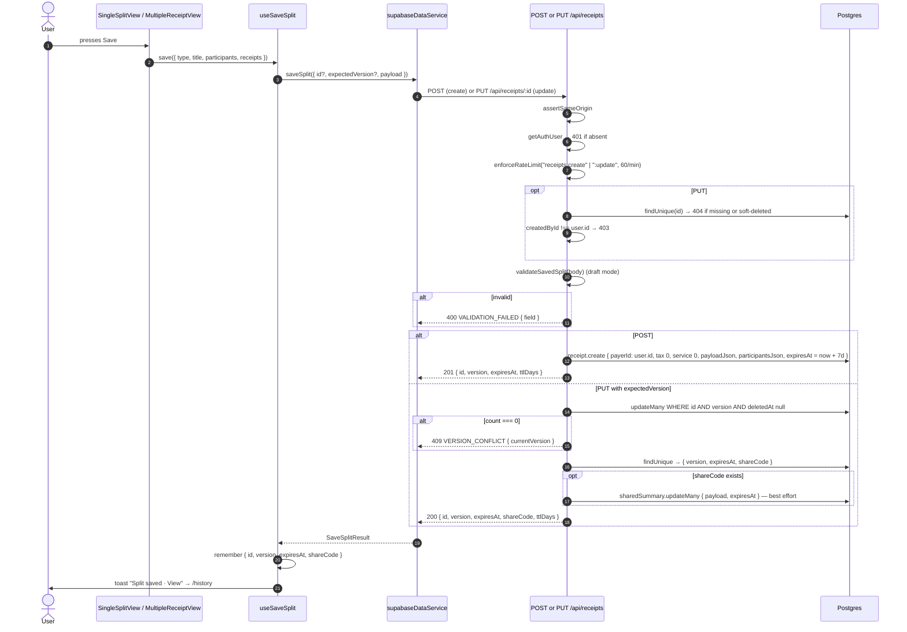
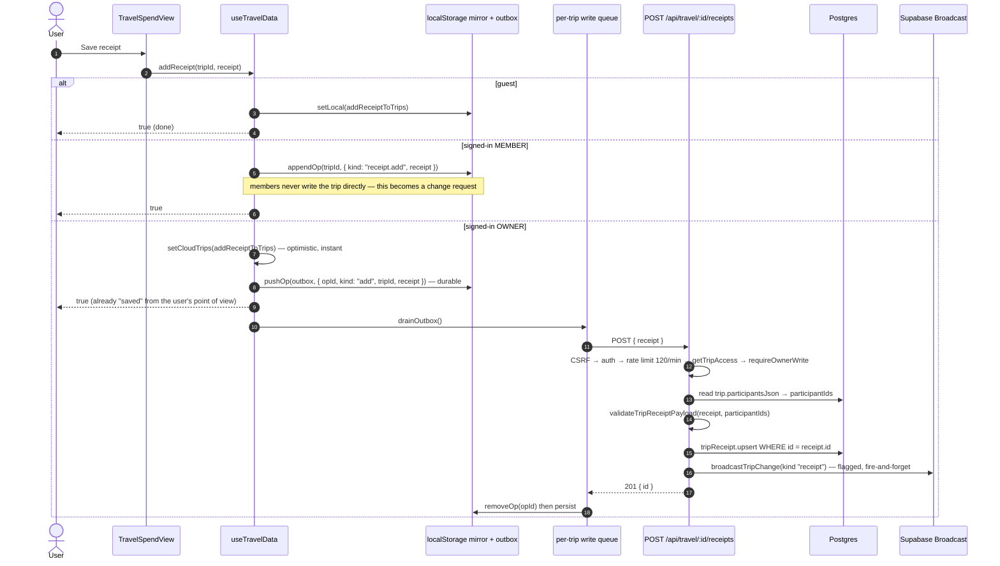
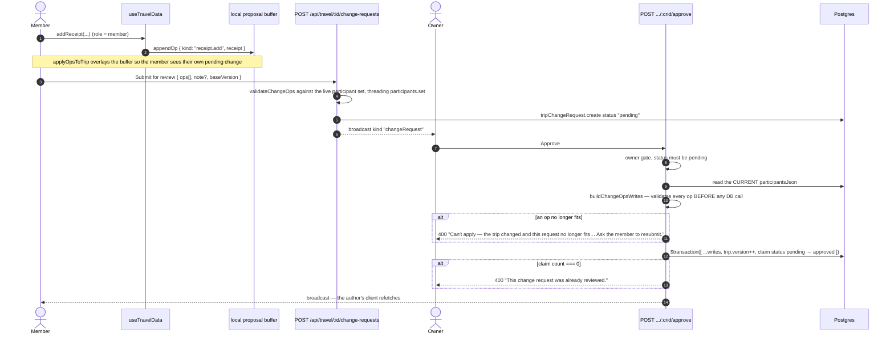

# Flow — Expense (Receipt) Creation

> From "add an expense" in the UI to a row in Postgres, across all three modes.
> The arithmetic that turns a receipt into per-person shares is in
> [split-bill-flow.md](./split-bill-flow.md); the AI extraction path is in
> [ai-scan-flow.md](./ai-scan-flow.md).
>
> Evidence labels: **[IMPLEMENTED]** · **[INFERRED]** · **[ASSUMED]** · **[UNKNOWN]**

---

## 1. "Expense" in Splitzy **[IMPLEMENTED]**

There is no `Expense` entity. The unit of spend is a **`Receipt`** — a document with items, tax,
service, fees, discounts and a payer. Three creation paths exist, and they persist very differently:

| Mode | Where the receipt lives | When the server sees it |
|---|---|---|
| **Single** (`/single`) | `localStorage["splitbill-single"]` | Only when the user presses **Save** (`POST /api/receipts`) — or shares a link |
| **Multiple** (`/multiple`) | `localStorage` | Same. Route is auth-gated by the proxy |
| **Travel** (`/travel`) | Guest: `localStorage["splitzy-travel"]` · Signed-in: cloud mirror + **outbox** → `POST /api/travel/[id]/receipts` | Immediately (or as soon as connectivity returns) |

**[IMPLEMENTED]** The design consequence is stated in `useSaveSplit`: *"These modes stay local-first:
localStorage remains the working state and the server is touched only when the user presses Save.
That keeps typing instant and the app usable offline, at the cost of the split living on one device
until they choose otherwise."*

---

## 2. Building a receipt — the editor **[IMPLEMENTED]**

Component: [ReceiptEditor](../../src/components/receipt/ReceiptEditor.tsx), composed of
`ReceiptInput` (scan), `ItemsTable`, `FeesInput`, `DiscountsInput`, `SummaryPanel`, and — in the
Single wizard — `ParticipantManager` and `Stepper`.

```
User
 ↓  add participants           ParticipantManager  → Participant[] { id, name, paymentInfo?, budget? }
 ↓  scan or type items         ReceiptInput / ItemsTable → ReceiptItem[]
 ↓  assign items to people     ItemsTable → assignedToIds[]  or  assignments[{ participantId, qty }]
 ↓  tax / service              numeric inputs
 ↓  extra fees                 FeesInput → ReceiptFee[] { label, amount, splitMethod }
 ↓  discounts                  DiscountsInput → Discount[] { scope, type, value, targetId? }
 ↓  choose the payer           select → payerId (a participant id)
 ↓  currency (Travel only)     select → currency + fxRate fetched from /api/fx-rate and LOCKED
 ↓
Receipt object (src/types/index.ts) held in React state, mirrored to localStorage on every change
 ↓
SummaryPanel recomputes shares on every keystroke — pure, synchronous, no network
```

### Two item-assignment modes

| Mode | Field | Behaviour |
|---|---|---|
| Equal | `assignedToIds: string[]` | `item.total` split evenly; remainder pushed onto the first assignee |
| Per-quantity | `assignments: [{ participantId, qty }]` | Proportional to units taken; remainder pushed onto the person with the most units |

`calculateItemShares` prefers `assignments` whenever present and non-empty.

### Client-side caps **[IMPLEMENTED]**

From [limits.ts](../../src/lib/limits.ts) and [input-limits.ts](../../src/lib/receipt/input-limits.ts):
`MAX_FEES_PER_RECEIPT = 50`, `MAX_DISCOUNTS_PER_RECEIPT = 100`, `MAX_AMOUNT = 1_000_000_000`.

These are shared with the server validators on purpose. The header of `limits.ts` explains why:
the forms used to let you add a 51st fee and *"only the share-link request failed, with an error the
user never asked for and couldn't act on. One definition means the form can disable itself at
exactly the point the server would start rejecting."*

---

## 3. Path A — saving a Single/Multiple split



### What is actually written **[IMPLEMENTED]**

```ts
prisma.receipt.create({
  title:            input.title,
  payerId:          user.id,      // "whose account is this saved under" — NOT who fronted the bill
  tax: 0, service: 0,             // legacy columns; the real values live in the payload
  createdById:      user.id,      // the only column that grants write access
  participantsJson: input.participants,
  payloadJson:      input,        // the authoritative document
  expiresAt:        savedSplitExpiryFromNow(),   // now + 7 days
})
```

No `ReceiptItem` and no `ItemAssignment` rows are created. Those tables cannot express a split
between named people who have no account.

### Conflict handling **[IMPLEMENTED]**

`useSaveSplit` distinguishes a `VERSION_CONFLICT` ("Saved somewhere else") from a generic failure,
*"because retrying blindly would clobber whichever copy is newer — send them to reload instead."*

### TTL semantics **[IMPLEMENTED]**

The 7-day clock is reset by **saving**, not by opening — the server never learns about an edit still
only in the browser. The UI therefore has to make Save prominent after an edit. A lapsed split is
hard-deleted by the cleanup job.

---

## 4. Path B — adding a receipt to a Travel trip

This is the local-first path, and it is the most involved write in the product.



### The outbox **[IMPLEMENTED]**

[travel-outbox.ts](../../src/lib/travel/travel-outbox.ts) — only receipts are queued, because they
use client-generated ids and an idempotent server `upsert`, so an op can be replayed any number of
times without temp-id remapping. Trip create, participant edits and payments stay
online-optimistic; they need connectivity anyway.

**Coalescing** keeps the queue minimal and internally consistent:

| New op after a pending op | Result |
|---|---|
| `add`/`update` after `add` | Stays `add` with the latest content — the server has never seen the receipt, so it must still be *created* |
| `add`/`update` after `update` | Stays `update` with the latest content |
| `delete` of a receipt whose `add` is still pending | **Both cancel out** — the receipt never existed server-side |

**Drain semantics** — FIFO, serialised through the per-trip queue, with four outcomes:

| Outcome | Trigger | Action |
|---|---|---|
| `ok` | 2xx | Remove the op, continue |
| `network` | fetch threw, offline, **5xx, or 429** | **Keep the op queued**, stop draining, resume on reconnect or next write |
| `permanent` | 4xx other than 403/`REVIEW_REQUIRED` | Discard the op, surface *"A change couldn't be saved and was discarded."*, re-pull authoritative state to drop the phantom, stop |
| `review` | `403 REVIEW_REQUIRED` | **Migrate the op into the member's proposal buffer** rather than dropping it — this covers a user demoted to member mid-flight |

**[IMPLEMENTED]** Treating 429 and 5xx as retryable rather than permanent is deliberate: they are
transient, and discarding on them would lose a user's receipt.

### Why a per-trip write queue **[IMPLEMENTED]**

Two guarantees, quoted from `useTravelData`:

1. *"Rapid successive trip PUTs never send the same `expectedVersion` twice (which would produce a
   false-positive 409 'changed elsewhere' even when the only editor is the current user)."*
2. *"A receipt write never reaches the server before a participant edit that precedes it has
   committed — otherwise the server would validate the receipt against a stale participant list and
   reject it (data loss)."*

### Hydration order on load **[IMPLEMENTED]**

```
uid known
 ↓ read mirror + outbox from localStorage (scoped { uid, data }; a foreign uid is ignored)
 ↓ paint replayOps(mergePrefs(mirror), outbox)      ← instant, works offline
 ↓ GET /api/travel  →  authoritative trips
 ↓ paint replayOps(mergePrefs(trips), outbox)       ← unsynced writes stay visible
 ↓ drainOutbox()
```

A `loadSeqRef` guard drops a slow initial load that resolves after a later sync, so it cannot
clobber trips the sync just added. A network failure keeps whatever the mirror already painted.

**[IMPLEMENTED]** A failed **mirror** write is reported to the user rather than swallowed, because
the mirror *is* the trip data between loads: *"a full quota meant every receipt added after that
point looked saved, worked all day, and was gone on the next reload — silently, in the one mode that
accumulates the most data."*

---

## 5. Path C — member proposes a receipt (change request)



**[IMPLEMENTED]** Approval is **last-write-wins**: `baseVersion` is recorded but not enforced; ops
are validated against the trip *as it looks now*.

---

## 6. Path D — legacy relational receipt

`POST /api/trips/[id]/receipts` writes the fully normalized shape: `Receipt` + nested `ReceiptItem`
+ nested `ItemAssignment`. `validateReceiptCreate` enforces two cross-field rules that exist to
protect settlement math:

- `payerId`, when set alongside `participantsJson`, must reference one of those participants —
  *"receipts where the payer isn't in the participant list produce phantom credits in settlement
  math."*
- Every `item.assignedToUserIds` entry must be in `participantsJson` — *"otherwise items get
  assigned to 'ghost' participants that no longer exist."*

**[INFERRED]** No caller for this endpoint exists in the shipped frontend.

---

## 7. Validation summary at the write boundary **[IMPLEMENTED]**

| Rule | Single/Multiple save | Travel receipt | Legacy trip receipt |
|---|---|---|---|
| Validator | `validateSavedSplit` | `validateTripReceiptPayload` | `validateReceiptCreate` |
| Title ≤ 200, name ≤ 100, id ≤ 100 | ✅ | ✅ | ✅ |
| ≤ 200 items | ✅ | ✅ | ✅ |
| ≤ 100 participants | ✅ | ✅ | ✅ |
| Assignee ids must be known participants | ✅ | ✅ | ✅ |
| Fees ≤ 50, discounts ≤ 100, amount ≤ 1e9 | ✅ | ✅ | ✅ |
| Payer must be a participant | relaxed in draft mode | ✅ | ✅ |
| Item name may be empty | relaxed in draft mode | ❌ | ❌ |
| Currency + `fxRate` bounds | ✅ | ✅ | n/a |

---

## 8. Side effects on a successful write **[IMPLEMENTED]**

| Effect | When | Failure handling |
|---|---|---|
| `broadcastTripChange` | Every travel mutation | Swallowed — clients still refetch on focus/reconnect |
| `logFeatureUsage("travel", "receipt.added")` | First travel receipt per browser session | `sessionStorage`-deduped, fire-and-forget |
| `logFeatureUsage("single" \| "multiple")` | First split per session | Same |
| `SharedSummary` refresh | `PUT /api/receipts/[id]` when `shareCode` is set | Logged only — must not turn a successful save into an error |
| Saved-split TTL reset | Every save | — |

---

## 9. Failure modes

| Failure | Behaviour | Label |
|---|---|---|
| Offline, Travel, signed-in | Op sits in the outbox; UI shows it as saved; drains on reconnect | **[IMPLEMENTED]** |
| Offline, Single/Multiple | Save fails with a toast; the local draft is untouched | **[IMPLEMENTED]** |
| `localStorage` full | `PersistError { kind: "quota" }` surfaces as a toast via `usePersistErrorToast` | **[IMPLEMENTED]** |
| Storage blocked entirely | `PersistError { kind: "unavailable" }`; the session works in memory only | **[IMPLEMENTED]** |
| Concurrent save from another device | `409 VERSION_CONFLICT` with `currentVersion`; the user is told to reload | **[IMPLEMENTED]** |
| Server rejects an outbox op with 4xx | Op discarded, error surfaced, authoritative state re-pulled | **[IMPLEMENTED]** |
| Member writes while demoted mid-flight | Op migrated into the proposal buffer | **[IMPLEMENTED]** |
| Trip deleted while an op is queued | Server 404 ⇒ `permanent` ⇒ op discarded + re-sync | **[INFERRED]** |
| Participant deleted between edit and sync | Server rejects with `VALIDATION_FAILED` ⇒ `permanent` ⇒ discarded | **[IMPLEMENTED]** |

---

## 10. Observations

| # | Observation | Label |
|---|---|---|
| 1 | A discarded `permanent` op surfaces one generic message and loses the receipt content — there is no "recover this rejected change" affordance | **[IMPLEMENTED]** |
| 2 | The saved-split TTL resets on save but not on open, so resuming a split without re-saving still lets it lapse on the original schedule | **[IMPLEMENTED]** |
| 3 | Single/Multiple have no outbox — a save attempted offline simply fails | **[IMPLEMENTED]** |
| 4 | The outbox coalesces per receipt but never bounds its own length | **[IMPLEMENTED]** |
| 5 | `Receipt.payerId` meaning differs between a saved split and a trip receipt, which is easy to misread when querying | **[IMPLEMENTED]** |
