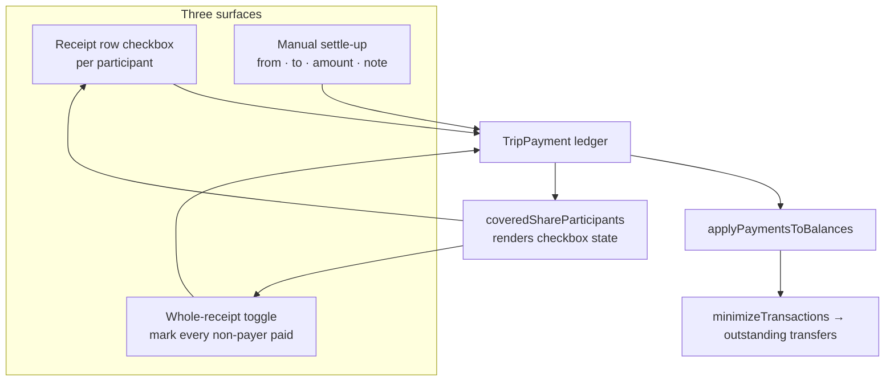
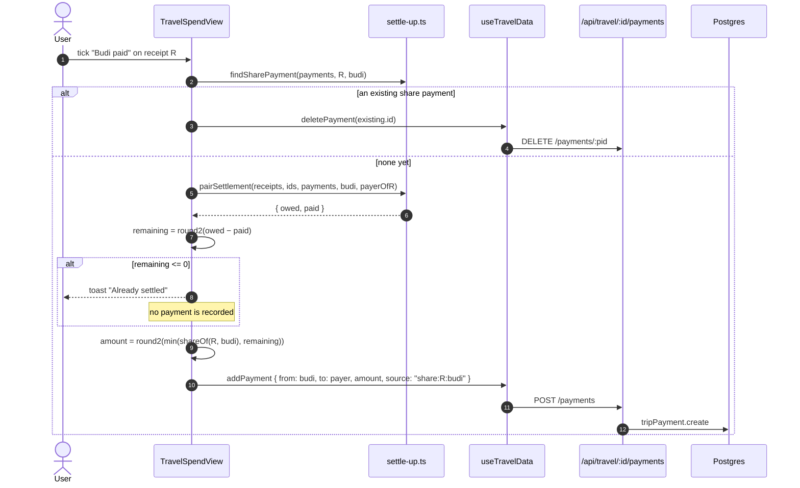

# Flow — Settlement ("who owes whom", and marking it paid)

> How outstanding debts are computed, recorded as paid, and reconciled across three different UI
> surfaces. The arithmetic that produces the balances is in
> [split-bill-flow.md](./split-bill-flow.md).
>
> Evidence labels: **[IMPLEMENTED]** · **[INFERRED]** · **[ASSUMED]** · **[UNKNOWN]**

---

## 1. Two settlement models **[IMPLEMENTED]**

Splitzy has **two entirely separate** "mark as paid" mechanisms. They do not share code, storage, or
semantics.

| | Single / Multiple | Travel Spend |
|---|---|---|
| Storage | `localStorage` — `splitzy-paid:<scope>` | **`TripPayment` rows in Postgres** |
| Hook / module | [`usePaidSettlements`](../../src/hooks/usePaidSettlements.ts) | [`settle-up.ts`](../../src/lib/travel/settle-up.ts) + `useTravelData` |
| Affects the maths? | **No** — purely cosmetic | **Yes** — reduces the balances |
| Synced across devices? | No | Yes |
| Survives sign-out? | No (key is not in the purge list, but is scope-keyed) | Yes |
| Partial payments? | No | Yes |
| Foreign currency? | n/a | Yes, converted at a locked `fxRate` |

The lightweight model states its own scope honestly:

> *Local-only by design — settle-up is a UX affordance ("I sent the transfer, cross it off the
> list") and does not need to be authoritative or synced across devices in this iteration. A future
> server-side version can extend this hook without changing the call sites.*

The rest of this document is about the Travel model, which is the real one.

---

## 2. The ledger **[IMPLEMENTED]**

`TripPayment` is the **single source of truth for what has been settled**.

```ts
{
  id, tripId,
  fromParticipantId,     // participant namespace — NOT a user id
  toParticipantId,
  amount,                // native amount
  currency?, fxRate?,    // absent ⇒ IDR
  note?,
  source?,               // null = manual settle-up
                         // "share:<receiptId>:<participantId>" = a per-receipt checkbox
  createdById, createdAt
}
```

Append-only in practice: created by `POST /api/travel/[id]/payments`, removed by
`DELETE …/payments/[pid]`, never updated.

The `source` encoding is what allows one ledger to back a receipt-level checkbox:

```ts
sharePaymentSource(receiptId, participantId)  // → "share:<receiptId>:<participantId>"
parseShareSource(source)                       // → { receiptId, participantId } | null
isManualPayment(payment)                       // → parseShareSource(...) === null
```

---

## 3. Computing what is outstanding

```
receipts + participants + payments
 ↓ computeTripTotals
   ↓ per receipt: receiptInBaseCurrency → getReceiptSummary → gross balances
   ↓ sum across receipts
   ↓ applyPaymentsToBalances  ← the ledger is applied ONCE, here
   ↓ minimizeTransactions
 ↓
SettlementTransfer[]  →  "Budi pays Alya Rp 67.383"
```

Gross per-receipt balances never account for payments. That is deliberate: applying them once, at
trip level, means *"there is a single source of truth and no way to double-count a payment."*

---

## 4. Three ways to mark something paid

All three write to the same ledger.



### 4.1 `pairSettlement` — the reconciliation primitive **[IMPLEMENTED]**

```ts
pairSettlement(receipts, participantIds, payments, from, to)
// → { owed, paid, settled }
```

- `owed` = the debtor's total share of **every receipt this payer fronted**, in IDR
  (`shareOwedOnReceipt` returns 0 when `from === receipt.payerId` — a payer never owes their own
  receipt).
- `paid` = **every** ledger payment `from → to`, manual *and* share-marker, converted to IDR.
- `settled` = `owed > 0 && paid >= owed - 0.01`.

Its docstring names the bug it prevents: *"This single check is what stops the same debt being
settled twice — e.g. a manual 'A paid B 200k' and then ticking A's receipt shares, which used to
double-count."*

### 4.2 Per-participant checkbox — `togglePaidShare` **[IMPLEMENTED]**



Two guards make this safe:

1. **Record only the remaining debt.** The in-code note is explicit: *"Recording the full share
   would over-settle and flip the payer negative — the ghost '+Rp 50.000 / −Rp 50.000' balance.
   remaining = owed − already-paid."*
2. **Convert to base currency first.** `shareOf` runs the receipt through `receiptInBaseCurrency`,
   *"so the ledger payment matches the IDR settlement balances — recording a native foreign amount
   here would over/under-settle a foreign receipt."*

Unticking deletes the marker payment, restoring the debt.

### 4.3 Whole-receipt toggle — `toggleReceiptPaid` **[IMPLEMENTED]**

Marks every non-payer who owes something (`share > 0`) as paid, or — if all are already marked —
undoes them all. Each person is still an individual ledger payment; there is no bulk row.

### 4.4 Manual settle-up **[IMPLEMENTED]**

A direct `from → to → amount` entry with an optional note, and optional `currency` + `fxRate` for a
foreign transfer. `source` is left null. Supports **partial** payments: any amount less than the
debt simply reduces the balance.

---

## 5. Rendering checkbox state — `coveredShareParticipants` **[IMPLEMENTED]**

A checkbox must show as ticked even when the debt was cleared some *other* way, or the surfaces
disagree with each other.

```ts
covered = paidShareParticipants(payments, receiptId)         // explicit share markers
for (const pid of participantIds) {
  if (pid === receipt.payerId || covered.has(pid)) continue;
  if (pairSettlement(receipts, participantIds, payments, pid, receipt.payerId).settled) {
    covered.add(pid);                                        // fully settled by any means
  }
}
```

> *This reconciles the receipt checkboxes with the ledger, so marking a settlement paid anywhere
> (receipt row, summary transfer, or a manual payment) is reflected consistently across every
> surface.*

Computed once per render pass into a `Map<receiptId, Set<participantId>>`.

---

## 6. Applying the ledger to balances **[IMPLEMENTED]**

```ts
const idr = paymentInBaseCurrency(p);           // amount × fxRate when foreign, else amount
if (!(idr > 0)) continue;
if (p.from === p.to) continue;
if (!next.has(p.from) || !next.has(p.to)) continue;   // both endpoints must still be participants
next.set(p.from, round2(next.get(p.from) + idr));      // debt → toward 0 from negative
next.set(p.to,   round2(next.get(p.to)   − idr));      // credit → toward 0 from positive
```

The both-endpoints guard exists because *"a payment that references a removed participant would
otherwise be half-applied (one side moves, the other doesn't), silently breaking conservation so the
net balances no longer sum to zero."*

**[IMPLEMENTED]** `paymentInBaseCurrency` is exported and reused for **display**, not just maths.
Showing the raw native `amount` beside an "Rp" label once reported a $100 settle-up as "Rp 100"
while the ledger had correctly moved Rp 1.600.000.

---

## 7. "All settled" **[IMPLEMENTED]**

`TravelSpendView` treats a trip as fully settled when `tripTotals.settlements.length === 0` — i.e.
`minimizeTransactions` produced no transfers, because every balance is within ±0.01 of zero.

---

## 8. Sync and collaboration

Payments are **not** in the offline outbox. Only receipts are, because they use client-generated ids
and an idempotent upsert; payments are online-optimistic:

```
addPayment → optimistic insert with a temp id → POST /payments
  → 2xx: replacePaymentInTrips(tempId, serverPayment)
  → failure: rolled back, surfaced through the sync-status banner
```

Every payment mutation calls `broadcastTripChange(kind: "payment")` when the `realtime` flag is on,
so other members' clients refetch. **[IMPLEMENTED]**

**Members cannot record payments directly** — `requireOwnerWrite` returns `403 REVIEW_REQUIRED`. A
member's settle-up becomes a `payment.add` op inside a change request, applied only on owner
approval. **[IMPLEMENTED]**

---

## 9. Single / Multiple settlement **[IMPLEMENTED]**

The lightweight path:

```
usePaidSettlements(scope)                 scope = "receipt:<id>" or "multiple:<id>"
 ↓ settlementKey(transfer) = `${from}>${to}:${Math.round(amount * 100)}`
 ↓ togglePaid(key)  →  Set<string>  →  localStorage["splitzy-paid:<scope>"]
 ↓ isPaid(key)      →  strikethrough / checkmark in SummaryPanel
```

Notes:

- The amount is baked into the key (rounded to 2 dp *"to tolerate float jitter when totals
  recompute"*), so **editing the split invalidates the marker** — the transfer reappears unticked.
  **[INFERRED]** That is arguably correct: the amount changed, so the old "paid" claim no longer
  describes the same debt.
- `scope` namespaces the markers so they *"don't bleed across different splits."*
- Storage failures are swallowed; the UI state still updates for the session.
- These markers are **not** in the sign-out purge list, so they persist on a shared device. They
  contain only participant ids and amounts. **[IMPLEMENTED]**

---

## 10. Failure modes

| Failure | Behaviour | Label |
|---|---|---|
| Marking a share paid when the debt is already covered | Toast "Already settled" and **no** payment recorded | **[IMPLEMENTED]** |
| Partial manual payment, then ticking the share | Only the remaining amount is recorded | **[IMPLEMENTED]** |
| Foreign receipt with an invalid `fxRate` | `needsFxRate` is true; amounts flow at 1:1 into the settlement unless the surface warns | **[IMPLEMENTED]** |
| Participant removed after payments exist | The payment is skipped entirely, preserving Σ = 0. The money "disappears" from the view | **[IMPLEMENTED]** |
| Payment POST fails | Optimistic insert rolled back; sync banner shows `error` | **[IMPLEMENTED]** |
| Two owners settle simultaneously | Both rows are created — payments are append-only with **no idempotency key**, so a double-tap across devices can double-settle | **[INFERRED]** |
| Member tries to settle | `403 REVIEW_REQUIRED` → becomes a change-request op | **[IMPLEMENTED]** |
| Editing a split after marking transfers paid (Single/Multiple) | Markers silently invalidate because the key embeds the amount | **[INFERRED]** |

---

## 11. Observations

| # | Observation | Label |
|---|---|---|
| 1 | Two unrelated settlement models with different guarantees; a user moving from `/single` to `/travel` gets materially different behaviour with no explanation in the UI | **[IMPLEMENTED]** |
| 2 | `TripPayment` has no idempotency key, so a retried or double-tapped settle-up creates two rows | **[INFERRED]** |
| 3 | Payments are excluded from the offline outbox, so settling up offline simply fails | **[IMPLEMENTED]** |
| 4 | A removed participant makes their payments invisible to the balance sheet — correct for conservation, but the money silently vanishes from the view with no warning | **[IMPLEMENTED]** |
| 5 | `coveredShareParticipants` is `O(receipts × participants)` per render pass; memoised once, fine at realistic sizes | **[IMPLEMENTED]** |
| 6 | Only the trip **owner** can record settle-ups, so in a shared trip one person must maintain the ledger for everyone | **[IMPLEMENTED]** |
