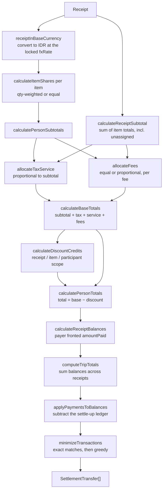
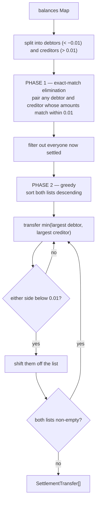

# Flow — Bill Splitting (the calculation engine)

> How a `Receipt` becomes per-person amounts, and how those become the minimum set of transfers.
> Everything here is **pure, synchronous, client-side TypeScript** —
> [src/lib/receipt/calculations.ts](../../src/lib/receipt/calculations.ts). The server never
> computes a split.
>
> Evidence labels: **[IMPLEMENTED]** · **[INFERRED]** · **[ASSUMED]** · **[UNKNOWN]**

---

## 1. Where the arithmetic lives **[IMPLEMENTED]**

```
Receipt (client state, or a payload read back from the DB)
 ↓
lib/receipt/calculations.ts   ← no React, no I/O, no dates, fully deterministic
 ↓
PersonShare[] · balances Map · SettlementTransfer[]
 ↓
SummaryPanel (editor)  ·  /s/[code] (server-rendered share page)  ·  /history/[id]
```

**[INFERRED]** Keeping the engine pure is why the same module can run in the editor, in a
server-rendered share page, and in ~10 unit-test files. It is also why the server can store an
opaque payload without ever needing to understand it.

Test coverage: `calculations.test.ts`, `calculations-extended.test.ts`, `settle-up.test.ts`,
`travel-spend.qa.test.ts`, `validation-fees-discounts.test.ts`.

---

## 2. The pipeline



---

## 3. Step by step

### 3.1 Currency normalisation **[IMPLEMENTED]**

`receiptInBaseCurrency(receipt)` is the **single conversion point**. Its comment is emphatic:

> *ANY aggregation across multiple receipts MUST run each receipt through this first — otherwise
> native amounts of different currencies get summed together.*

It multiplies `items[].unitPrice/total`, `tax`, `service`, `fees[].amount`, and **only `amount`-type
discounts** (percentages are rate-invariant) by the locked `fxRate`, then clears `currency`/`fxRate`.
IDR receipts and receipts with `rate === 1` are returned untouched.

`needsFxRate(receipt)` flags a foreign receipt whose rate is missing, zero, negative or non-finite.
Such a receipt passes through **unconverted**, so its native amounts land in IDR aggregates at 1:1 —
a ฿1.000 dinner appearing as Rp 1.000. The comment: *"Nothing about that is recoverable from the
numbers alone, so any surface that shows a converted total has to check this and say so rather than
let a wrong figure look authoritative."*

### 3.2 Item shares **[IMPLEMENTED]**

```ts
if (item.assignments?.length) {
  // qty-weighted: share = (a.qty / totalAssignedQty) * item.total
  // remainder → the person with the MOST units
} else if (item.assignedToIds.length) {
  // equal: share = item.total / n
  // remainder → the FIRST assignee
}
// unassigned item → empty map; the cost still counts toward receiptSubtotal
```

The equal-split remainder fix carries its reason inline: *"an indivisible total (e.g. 100 / 3 =
33.33 × 3 = 99.99) would otherwise leave the shares short of the item total, so the payer
under-fronts by a cent."*

**[IMPLEMENTED]** An item assigned to nobody still contributes to `receiptSubtotal`, so it inflates
the grand total while nobody is charged for it — meaning the payer eats the difference. That is
arguably correct (someone ordered it) but it is a silent outcome.

### 3.3 Tax and service **[IMPLEMENTED]**

Proportional to each person's subtotal:

```
share_i = (subtotal_i / receiptSubtotal) * tax        → remainder to the largest subtotal
```

**Zero-subtotal edge case**: when `receiptSubtotal === 0` (tax/service but no items) the amounts are
split **equally**, with the remainder to the first participant — *"otherwise the payer would be left
with phantom credit and the ledger would not balance."*

### 3.4 Extra fees **[IMPLEMENTED]**

Each `ReceiptFee` carries its own `splitMethod`:

| `splitMethod` | Rule | Remainder |
|---|---|---|
| `"equal"` | `amount / participantIds.length`, regardless of what anyone ordered | First participant |
| `"proportional"` | Same algorithm as tax/service | Largest subtotal (or equal split when `receiptSubtotal === 0`) |

The AI prompt biases toward `"equal"` for delivery/platform/packaging/surcharge fees — they are not
tied to order value — and `"proportional"` for fees that scale with the order amount.

Note the denominator difference: equal fees divide by **all participants**, whereas tax/service
divide by *subtotal share*. A participant who ordered nothing still pays their slice of the delivery
fee. **[INFERRED]** That is the intended semantics of an "equal" fee.

### 3.5 Discounts **[IMPLEMENTED]**

Discounts are applied **on top of** the fully-computed base share, because they behave like money
handed over at payment time.

| Scope | Resolves against | Distributed to |
|---|---|---|
| `"participant"` | That person's base total | Its owner only — a personal voucher |
| `"item"` | `item.total` | The item's consumers, proportional to their item share |
| `"receipt"` | `grandTotal` (subtotal + tax + service + fees) | Everyone, proportional to their base total |

Percentages resolve against a **pre-discount** base, so multiple discounts never compound.

Finally, each person's credit is **capped at their base share**:

```ts
credits.set(id, roundTo2(Math.min(credits.get(id) ?? 0, base)));
```

— *"a voucher never pays cash back or turns a share negative."*

### 3.6 Per-person total

```
total_i = subtotal_i + tax_i + service_i + fees_i − discount_i
```

`PersonShare` exposes every component, which is what makes the audit/transparency view
(`getPersonShareDetails`, `ItemBreakdown[]`) possible.

### 3.7 Per-receipt balances **[IMPLEMENTED]**

```ts
amountPaid = Σ shares[i].total          // what the payer actually handed over
payer   → balance = amountPaid − own share      // positive: is owed
others  → balance = −own share                  // negative: owes
```

The comment explains why `amountPaid` is the *post-discount* sum: *"The payer only fronted the actual
cash handed to the merchant… A personal voucher is the owner's own money-equivalent, so it reduces
that owner's share rather than crediting the payer."*

**Balances are gross.** Settle-ups are applied once, at trip level — *"so there is a single source of
truth and no way to double-count a payment."*

### 3.8 Trip aggregation **[IMPLEMENTED]**

`computeTripTotals(receipts, participantIds, payments)`:

1. Initialise every participant's balance to 0.
2. For each receipt: convert to base currency, compute its summary, add its balances, and accumulate
   `totalGrandTotal`, `totalDiscount`, `totalPaid`.
3. `applyPaymentsToBalances(balances, payments)`.
4. `minimizeTransactions(aggregateBalances)`.

`getTripSummary` is a thin wrapper. Both the summary UI and the API-facing summary go through this
one function *"so they can never diverge."*

### 3.9 Applying the ledger **[IMPLEMENTED]**

```ts
for (const p of payments) {
  if (p.from === p.to) continue;
  const idr = paymentInBaseCurrency(p);          // amount × fxRate when foreign
  if (!(idr > 0)) continue;
  if (!next.has(p.from) || !next.has(p.to)) continue;   // ← both endpoints must be tracked
  next.set(p.from, next.get(p.from) + idr);      // debt moves toward 0 from negative
  next.set(p.to,   next.get(p.to)   - idr);      // credit moves toward 0 from positive
}
```

The both-endpoints guard is load-bearing: *"A payment that references a removed participant would
otherwise be half-applied (one side moves, the other doesn't), silently breaking conservation so the
net balances no longer sum to zero."*

`paymentInBaseCurrency` is exported and reused for **display** as well as math, because showing the
raw native `amount` next to an "Rp" label once reported a $100 settle-up as "Rp 100" while the
ledger had correctly moved Rp 1.600.000.

---

## 4. Transaction minimisation **[IMPLEMENTED]**

`minimizeTransactions(balances)` — two phases, with a `0.01` epsilon throughout.



Phase 1 exists to *"prevent breaking up perfect 1-to-1 matches in the greedy loop"* — without it,
a clean "A owes B exactly 50k" can be shattered into two transfers by the greedy pass.

**[INFERRED]** The greedy algorithm produces at most `n − 1` transfers and is the standard heuristic
for this problem; it is **not** guaranteed minimal (optimal debt simplification is NP-hard). In
practice, with the exact-match pre-pass, it is optimal or near-optimal for group sizes this product
sees.

`buildSettlementTrace(initialBalances, transfers)` replays the transfers step by step, showing the
balance state after each — *"useful for explaining why A pays B even if B never paid for A
directly."*

---

## 5. Settle-up interaction

`pairSettlement` and the receipt-level "mark my share paid" checkbox are covered in
[settlement-flow.md](./settlement-flow.md).

---

## 6. Rounding policy **[IMPLEMENTED]**

Every arithmetic step passes through `roundTo2()`. Remainders are never dropped — each allocation
names a recipient:

| Allocation | Remainder recipient |
|---|---|
| Item share, qty-weighted | Person with the most units |
| Item share, equal | First assignee |
| Tax / service, proportional | Largest subtotal |
| Tax / service, zero-subtotal | First participant |
| Fee, equal | First participant |
| Fee, proportional | Largest subtotal |

**[INFERRED]** "First" means first in array order, which is participant creation order — stable
within a session but arbitrary from the user's point of view. For IDR, where the smallest realistic
unit is Rp 1 and displays are integer-only, a sub-rupiah remainder is invisible.

**[IMPLEMENTED]** All amounts are IEEE-754 `Float`/`double`, not `Decimal`. `roundTo2` after every
operation bounds the drift.

---

## 7. Worked example

Four people, one delivery receipt.

```
Items
  Nasi Goreng  Rp 50.000  → Alya, Budi (equal)
  Sate         Rp 60.000  → Budi (qty 2 of 3), Citra (qty 1 of 3)
  Es Teh       Rp 10.000  → Dita
Tax (PB1 10%)     Rp 12.000
Service            Rp 6.000
Delivery fee      Rp 12.000  splitMethod "equal"
Discount          Rp 20.000  scope "receipt", type "amount"
Payer: Alya
```

**Item shares** — Alya 25 000 · Budi 25 000 + 40 000 = 65 000 · Citra 20 000 · Dita 10 000.
`receiptSubtotal` = 120 000.

**Tax + service, proportional** (18 000 total):

| | share of subtotal | tax + service |
|---|---|---|
| Alya | 20.83 % | 3 750 |
| Budi | 54.17 % | 9 750 |
| Citra | 16.67 % | 3 000 |
| Dita | 8.33 % | 1 500 |

**Delivery fee, equal** — 3 000 each.

**Base totals** — Alya 31 750 · Budi 77 750 · Citra 26 000 · Dita 14 500. Σ = 150 000.

**Receipt discount** of 20 000, proportional to base total:
Alya 4 233 · Budi 10 367 · Citra 3 467 · Dita 1 933.

**Effective totals** — Alya 27 517 · Budi 67 383 · Citra 22 533 · Dita 12 567. Σ = 130 000 =
`amountPaid` (grandTotal 150 000 − discount 20 000).

**Balances** — Alya +102 483 (fronted 130 000, owes 27 517) · Budi −67 383 · Citra −22 533 ·
Dita −12 567. Sum = 0. ✅

**Minimised transfers** — no exact match, so the greedy pass yields three payments, all to Alya:
Budi 67 383 · Citra 22 533 · Dita 12 567.

*(Figures rounded for readability; the engine rounds each step to 2 dp and assigns remainders as per
§6.)*

---

## 8. Edge cases the engine handles explicitly **[IMPLEMENTED]**

| Case | Behaviour |
|---|---|
| Item assigned to nobody | Counts toward `receiptSubtotal`; nobody is charged; the payer absorbs it |
| Zero `receiptSubtotal` with tax/service | Split equally rather than proportionally |
| Indivisible totals | Remainder deliberately assigned |
| Discount larger than a person's share | Capped at the base share; never negative |
| Percent discount > 100 | Rejected at the AI-parse boundary; the validator bounds it too |
| Payer owing their own receipt | `shareOwedOnReceipt` returns 0 when `from === payerId` |
| Foreign receipt with no usable rate | `needsFxRate` flags it; amounts flow through at 1:1 unless a caller surfaces the warning |
| Payment referencing a removed participant | Skipped entirely, preserving conservation |
| `from === to` payment | Skipped |
| Non-positive payment | Skipped |
| Balance within ±0.01 | Treated as settled |

---

## 9. Invariants

| # | Invariant | Held by |
|---|---|---|
| 1 | Σ balances = 0 | Construction of `calculateReceiptBalances` + the both-endpoints payment guard |
| 2 | Σ per-person shares = `amountPaid` | Deliberate remainder assignment at every step |
| 3 | Every share ≥ 0 | Discount capped at the base share |
| 4 | A payer never owes their own receipt | `shareOwedOnReceipt` |
| 5 | Transfers fully clear all balances | `minimizeTransactions` runs until one side is exhausted |
| 6 | Percentages never compound | All resolve against a pre-discount base |
| 7 | Mixed currencies never sum unconverted | `receiptInBaseCurrency` at the single conversion point — **except** when `needsFxRate` is true |

---

## 10. Observations

| # | Observation | Label |
|---|---|---|
| 1 | Greedy minimisation is a heuristic, not provably minimal | **[INFERRED]** |
| 2 | Phase 1 is `O(d × c)` and mutates the arrays in place; fine at realistic group sizes | **[IMPLEMENTED]** |
| 3 | `Float` rather than `Decimal` for money | **[IMPLEMENTED]** |
| 4 | An unassigned item silently shifts cost onto the payer | **[IMPLEMENTED]** |
| 5 | Remainder recipients depend on array order, so they are stable but arbitrary to the user | **[INFERRED]** |
| 6 | `needsFxRate` correctness depends on every display surface remembering to check it — the engine cannot enforce that | **[IMPLEMENTED]** |
