# Splitzy — Roadmap

> ⚠️ **This roadmap is derived from technical code analysis and identified product gaps. It reflects
> technical observations only and does not incorporate business priorities, user research,
> stakeholder input, or market context. All phases marked [TECHNICAL-ONLY] should be validated with
> business stakeholders before execution.**

**Supersedes the Phase B placeholder.** The nine candidate themes it recorded (T1–T9) are all carried
forward; §7 maps each to its phase. Every item below traces to a `GAP-XXX`, `TD-XXX`, `UXD-XXX` or
`VULN-XXX` — nothing appears here because other apps have it.

Sequencing: [../analysis/improvement-backlog.md](../analysis/improvement-backlog.md) ·
[product-backlog.md](./product-backlog.md)

---

## Shape of the plan

```mermaid
gantt
    dateFormat X
    axisFormat %s
    title Five phases, sequenced by dependency (relative effort, not calendar)

    section 0 · Verify
    Answer four unknowns          :done, p0, 0, 1
    section 1 · Critical stability
    Upgrade, authz tests, RLS     :p1, 1, 6
    section 2 · See the product
    Telemetry, errors, E2E, gate  :p2, 6, 10
    section 3 · Finish what exists
    Unwired features, localisation:p3, 10, 16
    section 4 · Harden and pay down
    Consistency, perf, structure  :p4, 16, 24
    section 5 · Product bets
    Reminders, groups, split modes:p5, 24, 40
```

Each phase has an **exit condition**. A phase is not "done when the tickets close" — it is done when
a stated property of the system is true.

---

## Phase 0 — Verify before you build

**[TECHNICAL-ONLY]** · Effort: **half a day** · Traces to GAP-032, GAP-033, GAP-034

Four facts are **[UNKNOWN]** from the repository alone, and each one moves a Critical item. Nothing
else should start until they are answered, because two of them could delete work from Phase 1 and one
could promote work into it.

| Check | Where | Consequence |
|---|---|---|
| Is RLS enabled on the seven data tables? | Supabase → Auth policies | If yes, **PBI-003 drops out of Critical** entirely |
| Is the cleanup endpoint scheduled? | Vercel → Cron | If no, **BR-072 – BR-077 are unenforced** and expired share links containing bank details persist |
| Are `POSTHOG_KEY` and `SENTRY_DSN` set in production? | Vercel → Env | If no, Phase 2 is *installation*, not improvement |
| Is `FLAG_XENDIT_CHECKOUT` on? | Vercel → Env | If yes, **untested payment code is live** and PBI-016 becomes Critical |

**Exit condition:** all four answered in writing, and the four `[UNKNOWN]` labels in
[../analysis/product-gaps.md](../analysis/product-gaps.md) replaced with facts.

**[INFERRED]** This phase exists because the documentation was produced from source. A code reader
can prove what the application enforces; it cannot see what the platform is configured to do. Half a
day of dashboard reading is worth more here than a week of building.

---

## Phase 1 — Critical stability

**[TECHNICAL-ONLY]** · Effort: **~1 week** · Theme: *stop the next PBI-000 from being found by
accident*

One authorization bypass was found during this exercise — not by a test, but by rendering the app in
a browser. It is fixed. This phase is about the fact that **nothing in the repository would have
caught it**, and that a second path to the same failure is still open.

| # | Item | Traces to | Effort |
|---|---|---|---|
| 1 | Upgrade Next.js past the proxy-bypass advisory | VULN-002, TD-017 | S |
| 2 | Authorization regression tests (TC-013 … TC-028) | TD-011, VULN-010 | M |
| 3 | Enable Row Level Security, with policies in version control | VULN-010, TD-001, GAP-032 | M |
| 4 | Schedule and credential the retention job | GAP-014, GAP-033, VULN-008 | S |
| 5 | Seeded staging test account | test-strategy §6 | M |
| 6 | CSRF test case — the only critical rule with no test | GAP-003 | S |

**Order matters:** item 5 unblocks item 2, and item 2 must exist before item 3, because enabling RLS
without authorization tests means discovering a badly-scoped policy in production.

Item 1 is independent and takes one command; do it first for the morale.

**Exit condition:** `npm audit --audit-level=high` is clean; a revert of the PBI-000 fix turns a test
red; RLS policy SQL is committed; one cleanup run has been observed.

**Not in this phase, deliberately:** VULN-003 through VULN-012. Each is real and each is Medium or
Low. Bundling them here would dilute a phase whose value is that it is short enough to actually
finish.

---

## Phase 2 — Make the product visible

**[TECHNICAL-ONLY]** · Effort: **~1 week** · Theme: *stop guessing*

Splitzy currently cannot answer two questions about itself: **what fraction of visitors finish a
split**, and **what is failing in production**. The instrumentation for both is installed and
partially wired. This phase finishes the wiring.

| # | Item | Traces to | Effort |
|---|---|---|---|
| 1 | Fire `split_completed`, `mode_selected`, `pricing_viewed`; call `identify()` / `reset()` | GAP-027 | S |
| 2 | `captureException` on swallowed catches; supply `ErrorBoundary.onError`; upload source maps | GAP-028, UX-019 | S |
| 3 | One E2E test that completes a split end to end | TD-014 | S |
| 4 | `npm audit` as a CI step | TD-013, TD-018 | S |
| 5 | Make CI a deploy gate | TD-021 | S |
| 6 | Route-handler tests for billing, including webhook idempotency | TD-012 | M |

**Why this precedes Phase 3:** every prioritisation decision after this point is currently guesswork.
Shipping features before the funnel is measurable means never learning whether they worked. Items 1
and 2 together are perhaps four hours of work and change what the next six months can be based on.

Item 5 is the quiet keystone — until CI blocks deployment, items 3, 4 and 6 are advisory.

**Exit condition:** the funnel `$pageview → mode_selected → scan_completed → split_completed →
upgrade_clicked` is queryable; a deliberately failed checkout appears in Sentry with a readable
stack; a commit with a failing test does not reach production.

**Gate on revenue:** item 6 green is the precondition for switching `FLAG_XENDIT_CHECKOUT` on
(GAP-017). A duplicate webhook double-granting Pro is a revenue bug that would currently be
invisible in both directions.

---

## Phase 3 — Finish what already exists

**[TECHNICAL-ONLY]** · Effort: **~2 weeks** · Theme: *the highest-value work is completion, not
construction*

This is the largest genuinely-valuable phase, and almost all of it is small. Seven analysis findings
describe **finished, tested code that no user can reach**; seven more describe features wired to some
screens and not others.

### Unwired functionality

| # | Item | Traces to | Effort |
|---|---|---|---|
| 1 | Wire delete + restore for saved splits | GAP-011, UXD-005, UX-015 | S |
| 2 | Wire CSV export, or delete its 110 tested lines | GAP-012, UXD-005 | S |
| 3 | Adopt `EmptyState`, or remove it | GAP-025, UXD-008 | S |
| 4 | Retire the legacy trips API and its two orphaned entities | GAP-023, GAP-029, TD-002, TD-004 | M |
| 5 | Remove `lucide-react`; rename the `LucideIcon` alias | GAP-026, TD-019 | S |

### Accessibility

| # | Item | Traces to | Effort |
|---|---|---|---|
| 6 | Fix dark-mode `--primary` (3.27:1) and the 404 badge (2.15:1) | UXD-003, UX-011 | S |
| 7 | Add an `<h1>` to the five product screens that have none | UXD-002, UX-002 | S |
| 8 | Footer touch targets to 24 px | UXD-012, UX-004 | S |
| 9 | axe or pa11y in CI | ux-audit §a11y | S |

### The Indonesian experience

| # | Item | Traces to | Effort |
|---|---|---|---|
| 10 | Localise `/s/[code]` and `/share` | GAP-013, UXD-004 | M |
| 11 | Localise `/privacy` and `/terms` | GAP-013, UXD-004 | M |

### Honesty and clarity

| # | Item | Traces to | Effort |
|---|---|---|---|
| 12 | Resolve the settle-up semantic divergence | GAP-018, UXD-001, UX-007 | M |
| 13 | Warn when items are left unassigned | UXD-010, GAP-018 | S |
| 14 | Disclose what a share link contains; offer a paymentInfo toggle | UXD-011, VULN-005 | S |
| 15 | Implement or remove "Priority AI processing" | GAP-030 | S |
| 16 | Replace fabricated statistics and testimonials | GAP-031 | S |
| 17 | Update the README | TD-025 | S |
| 18 | Dashboard error states | UXD-006 | S |
| 19 | Save-prompt after mid-split sign-in | UXD-009 | S |

**[INFERRED]** Nine of the UX items share one shape: *a good pattern exists in this codebase and was
not extended to every screen*. The dashboard has no error state while five other screens do; five
screens lack an `<h1>` while the marketing routes assert theirs in E2E. That makes the right
intervention a **coverage sweep against the app's own standards**, not a redesign — which is why
these are grouped rather than scattered.

**Exit condition:** no route lacks an `<h1>`; every primary CTA clears 4.5:1 in both themes; the
share page renders in Indonesian; no shipped code path is unreachable; no unsourced claim on the
landing page.

---

## Phase 4 — Harden and pay down

**[TECHNICAL-ONLY]** · Effort: **~3 weeks** · Theme: *the rest of the security findings, and the
structure*

| Group | Items | Traces to |
|---|---|---|
| **Remaining security** | Consistent ban enforcement · stop disclosing the inviter's email · rate-limit `/api/fx-rate` · remove `GET = POST` on cleanup · constant-time secret comparison · idempotency on settle-up payments · remove the personal email from `add_user_role.sql` and `reply_to` | VULN-003 – VULN-009, VULN-011, VULN-012, GAP-022, TD-024, TD-030 |
| **Rate limiting & quota** | Migrate the ~28 endpoints still on the in-memory limiter · make the quota check atomic · cap anonymous scanning | GAP-015, GAP-016, TD-031, TD-032, VULN-006 |
| **Performance** | Paginate `GET /api/travel` · client data cache · index `users.created_at` | TD-027, TD-028, TD-029 |
| **Configuration** | Migration tooling with history · env validation at boot · document `CLEANUP_TOKEN` and `NEXT_PUBLIC_APP_URL` | TD-020, TD-022, TD-023 |
| **Consistency** | One success-response shape · finish the design-token migration · standardise loading affordances · replace the scan client's magic strings · clean orphaned CSS headers | GAP-019, GAP-020, GAP-021, TD-008, TD-009, TD-026, UXD-007, UXD-013 |
| **Compliance** | Make account deletion possible — five `Restrict` FKs currently make it impossible | GAP-006, FR-012 |
| **Structure** | Decompose `TravelSpendView` (2 086 lines) and `useTravelData` (1 128) | TD-006, TD-007 |
| **PWA polish** | Offline page · service-worker update prompt · exclude auth pages from the SW cache | pwa.md §10.7 |

**Why account deletion sits here and not earlier:** it needs Phase 4's migration tooling to be done
safely, and the audit trail is deliberately FK-free so it survives deletion — which constrains the
design and makes this a real decision, not a patch. **[TECHNICAL-ONLY]** If a data-subject erasure
request arrives, or if the product enters a jurisdiction that mandates one, this becomes Phase 1
work overnight. That call is not the code's to make.

**Exit condition:** every VULN closed or accepted in writing; the rate-limit flag is meaningful when
enabled; no file over ~800 lines; a data-subject erasure request can be honoured.

---

## Phase 5 — Product bets

**[TECHNICAL-ONLY] — and this label matters more here than anywhere else.**

Everything above is derivable from code. Nothing below is. These four items were ranked **Low** in the
backlog for one narrow reason — *no code evidence demands them* — and that criterion is close to
meaningless for product strategy. They are listed last because the analysis cannot justify putting
them earlier, **not because they are worth less**.

| Item | Traces to | Effort | The observation behind it |
|---|---|---|---|
| **Payment reminders / notifications** | GAP-007 | L | The product computes exactly who owes whom, renders it, and stops. There is no notification infrastructure of any kind — no email on settlement, no reminder, no push despite an installed PWA. Getting the user actually paid back is the value proposition, and it currently ends at a number pasted into WhatsApp |
| Participant-side view | GAP-008 | L | The two identity namespaces never join: `users.id` is who may access, participant ids inside `jsonb` are who the bill is split between. A participant cannot sign in and see what they are part of. This caps how far the product spreads inside a group |
| Persistent groups / recurring expenses | GAP-009 | L | Trips are episodic by construction. The flatmates use case is entirely unserved — the clearest functional divergence from competitors |
| Percentage / custom-amount splitting | GAP-010 | M | Splitzy splits by consumption only. A taxi, a rented villa, or a shared utility bill cannot be split at all |

**Sequencing note:** Phase 2's telemetry is what turns this phase from speculation into a decision.
Once `split_completed` fires and `identify()` runs, the product can see where users stop — and
whether they stop at the point PBI-061 addresses. **[TECHNICAL-ONLY]** Committing to any of these
before that data exists is a bet; after it, it is a choice.

**Exit condition:** none stated. This phase should be re-derived from usage data and stakeholder
input, not from this document.

---

## Deliberately not on this roadmap

Recorded so their absence is a decision rather than an oversight.

| Not doing | Why |
|---|---|
| A component-library migration | The hand-rolled shadcn-style system is coherent, tokenised, and documented. There is no evidence of a problem it would solve |
| A state-management library | Local-first sync with a durable outbox and optimistic locking is working. TD-028 asks for a *data cache*, which is a different thing |
| Splitting the monolith | 54 endpoints in one Next.js app is appropriate at this size |
| Native apps | The PWA is installable and audited. No evidence supports the cost |
| Features common in competitors but traceable to no finding | The Phase D rule: every item traces to a GAP, TD, UXD or VULN. Four items in Phase 5 are the closest to exceptions, and each names the code observation it rests on |

---

## Mapping from the Phase B placeholder

All nine candidate themes are carried forward; none was dropped.

| Phase B theme | Now |
|---|---|
| T1 — Finish what is already built | **Phase 3**, items 1–5 |
| T2 — Make the funnel measurable | **Phase 2**, items 1–2 |
| T3 — Close the authorization test gap | **Phase 1**, items 2, 5, 6 |
| T4 — Decide the monetisation switch | **Phase 2** item 6 (precondition) → open decision #4 |
| T5 — Complete the Indonesian experience | **Phase 3**, items 10–11 |
| T6 — Replace fabricated social proof | **Phase 3**, item 16 |
| T7 — Confirm and harden operations | **Phase 0** + **Phase 4** |
| T8 — Reduce structural debt | **Phase 4**, structure and consistency groups |
| T9 — Product decisions deferred in code comments | [product-backlog.md §7](./product-backlog.md#7-open-product-decisions) |

---

## The shape of the whole thing

**[INFERRED]** Phases 0–3 total roughly four weeks and contain almost every item with a user-visible
or risk-reducing payoff. That is unusual, and it follows from what the analysis found: Splitzy's
problems are overwhelmingly **completion and verification problems**, not capability or architecture
problems. The money engine is correct and well tested, the sync layer is genuinely sophisticated, the
design system is coherent, and the API is uniformly guarded.

What is missing is the last ten per cent on a number of things at once — a caller for a finished
function, an `<h1>` on a screen that has everything else, a test for the rule that matters most, a
scheduled job for a policy that is already written down.

That is a good problem to have, and a cheap one to fix.
