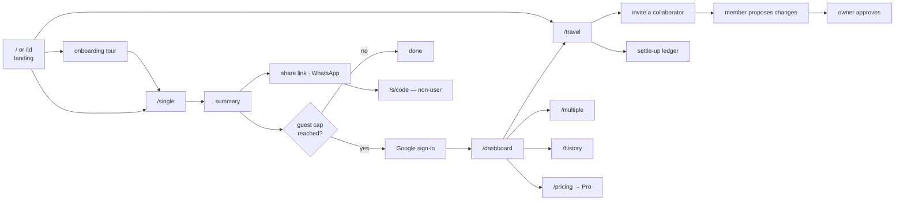

# Splitzy — User Journeys

> Eight end-to-end journeys, mapped step by step against the actual routes, API calls and business
> rules the code executes. Exit and failure points are marked, because they are where the product
> either recovers or loses the user.
>
> `BR-xxx` → [../requirements/business-rules.md](../requirements/business-rules.md) ·
> `API-xxx` → [../api/endpoints.md](../api/endpoints.md) ·
> `P-xx` → [personas.md](./personas.md)
>
> **A note on framing.** Splitzy has no "groups" and no "expense" entity. The unit of work is a
> **receipt**, and the collaborative container is a **trip**. Journey 2 below is therefore the trip
> expense flow, which is the nearest real equivalent.

---

## Journey map

---

## Journey 1 — New user onboarding

**Persona** P-04 → P-01 · **Entry** organic search, or a shared link · **Goal** first successful
split, then an account.

| # | Step | Route | API | Rules | Exit / failure |
|---|---|---|---|---|---|
| 1 | Land on the marketing page | `/` or `/id` | — | BR-089 | Bounce |
| 2 | Onboarding dialog opens (once per browser) | `/` | — | — | Skip → `onboarding_skipped` |
| 3 | Step through 3 value cards | `/` | — | — | Escape or backdrop dismisses; Back returns a step |
| 4 | Press **Finish** | → `/single` | — | — | `onboarding_completed { step }` |
| 5 | Add participants | `/single?` | — | BR-080 | Abandon |
| 6 | Scan or type items | `/single?step=bill` | API-045 | BR-059, BR-085, BR-086 | Scan failure → manual entry |
| 7 | Assign items, set tax/service/fees | same | — | BR-001 – BR-011 | — |
| 8 | View the summary | `/single?step=summary` | — | BR-017 – BR-031 | — |
| 9 | Guest counter increments | — | — | BR-057 | — |
| 10 | Share to WhatsApp | — | API-008 | BR-058, BR-073 | Payload too large → 413 |
| 11 | *(4th split)* Guest-limit dialog | — | — | BR-057 | **"Later" dismisses — the split still completes** |
| 12 | Sign in with Google | → `/api/auth/callback` | API-002 | BR-040, BR-041 | `?error=no_code` / `?error=auth_failed` |
| 13 | Account created; referral + welcome email if applicable | — | — | BR-042, BR-071 | DB failure → signed in with no `User` row |
| 14 | Return to the originating page | `next` | API-003 | — | — |

**Observations.** The tour ends by *starting a real split* rather than dismissing — the strongest
conversion decision in the flow. The guest gate is deliberately soft, so a rejected prompt costs the
user nothing. **[IMPLEMENTED]** But local work is **not** migrated on sign-in: the user must
explicitly press Save afterwards, and nothing in the UI tells them so at that moment.

---

## Journey 2 — Trip expense flow *(the "group expense" equivalent)*

**Persona** P-02 · **Entry** dashboard or `/travel` · **Goal** a week of shared spend, correctly
apportioned.

| # | Step | Route | API | Rules | Exit / failure |
|---|---|---|---|---|---|
| 1 | Open Travel Spend | `/travel` | API-025 | BR-050 | Guest → local-only mode |
| 2 | Create a trip (name, optional budget) | `/travel` | API-026 | BR-080 | Validation → 400 |
| 3 | Add participants (names, not accounts) | `/travel?trip=<id>` | API-028 | BR-081, BR-087 | 409 → reload |
| 4 | *(optional)* Set per-person budgets | same | API-028 | — | — |
| 5 | Add a receipt — scan or manual | same | API-045 → API-031 | BR-059, BR-086 | **Offline → queued in the outbox** |
| 6 | *(foreign currency)* Fetch and lock an FX rate | same | API-007 | BR-036, BR-039 | FX failure → enter manually |
| 7 | Assign items, add fees and discounts | same | — | BR-001 – BR-016 | — |
| 8 | Receipt applies to the mirror instantly; outbox drains | same | API-031 | BR-087 | 4xx → discarded + re-pull · 5xx/429 → requeued |
| 9 | Repeat across the trip, sometimes offline | same | API-031 | — | — |
| 10 | Watch budget vs spent | same | — | — | — |
| 11 | Review the settlement | same | — | BR-023 – BR-028, BR-037 | — |

**Collaboration branch**

| # | Step | Route | API | Rules |
|---|---|---|---|---|
| 12 | Owner creates an invite link (7-day TTL) | `/travel` | API-037 | BR-053 |
| 13 | Invitee opens the link — public, no account needed | `/invite/<token>` | API-043 | BR-052 |
| 14 | Invitee signs in and joins | — | API-044 | — |
| 15 | Invitee lands **directly on that trip** | `/travel?trip=<id>` | API-027 | BR-050 |
| 16 | Member adds a receipt → becomes a local proposal | `/travel` | — | **BR-049** |
| 17 | Member submits for review | — | API-040 | BR-081 |
| 18 | Owner reviews a human-readable diff | — | API-039 | BR-051 |
| 19 | Owner approves → ops re-validated, applied atomically | — | API-041 | BR-081, BR-087 |
| 20 | All members notified *(when the realtime flag is on)* | — | — | — |

**Failure points.** Step 5 offline is the one the architecture is built around, and it succeeds.
Step 19 is the sharpest edge: if the trip moved on, approval fails cleanly with *"Ask the member to
resubmit"* and writes nothing — correct, but the member's work must be redone.

---

## Journey 3 — Settlement

**Persona** P-02 · **Goal** everyone square, with the fewest transfers.

| # | Step | Route | API | Rules | Notes |
|---|---|---|---|---|---|
| 1 | Open the settle-up view | `/travel` | — | BR-023 | — |
| 2 | System computes gross balances per receipt | — | — | BR-019 – BR-022 | Foreign receipts converted first (BR-037) |
| 3 | Ledger payments applied **once**, at trip level | — | — | BR-023, BR-024 | Payments with a removed participant are skipped |
| 4 | Balances netted into minimal transfers | — | — | BR-026 – BR-028 | Exact matches paired first |
| 5 | User sees "Budi → Alya Rp 67.383" | — | — | — | — |
| 6a | **Record a manual payment** | — | API-034 | BR-025, BR-030 | Partial amounts accepted; foreign amounts converted |
| 6b | **Tick one person's share on a receipt** | — | API-034 | **BR-031** | Records only `owed − already paid` |
| 6c | **Toggle a whole receipt paid** | — | API-034 ×N | BR-031 | Every owing non-payer at once |
| 7 | Checkbox state reconciles across surfaces | — | — | BR-032 | A manual settle-up marks the receipt covered too |
| 8 | Trip reads "all settled" when no transfers remain | — | — | BR-026 | — |
| 9 | Undo — untick, or delete the payment | — | API-035 | — | Debt returns |

**Exit / failure points**

- Ticking an already-covered share → a toast, and **nothing is written** (BR-031).
- A member attempting any of this → `403 REVIEW_REQUIRED` (BR-049).
- Offline → **fails**; payments are not in the outbox.
- A double-tap across devices → **two rows**, because payments have no idempotency key.

**The Single/Multiple divergence [IMPLEMENTED].** The same-looking "mark as paid" checkbox in
`/single` and `/multiple` is a **cosmetic `localStorage` flag** (BR-033) that does not change the
maths, does not sync, and silently invalidates when the amount changes (BR-034). Nothing in the UI
signals this difference.

---

## Journey 4 — Transaction history

**Persona** P-01 · **Goal** find and reopen a past split.

| # | Step | Route | API | Rules | Exit / failure |
|---|---|---|---|---|---|
| 1 | Open History | `/history` | — | BR-044 | Signed out → in-page sign-in gate |
| 2 | List loads, newest first | — | API-009 | BR-047 | Empty → "No receipts yet" |
| 3 | Each card shows title, date, total, participants, **days remaining** | — | — | BR-072 | — |
| 4 | Search by receipt or trip name (300 ms debounce) | — | API-009 | — | No match → "No receipts match your search" |
| 5 | Load more | — | API-009 | — | — |
| 6 | Open a detail view | `/history/<id>` | API-011 | BR-046, BR-047 | 404 deleted · 403 not involved |
| 7 | Press **Continue** → reopen in the right editor | `/single?resume=` or `/multiple?resume=` | API-011 | — | Resume failure → toast + reset |
| 8 | Edit and re-save; the linked share link refreshes | — | API-012 | BR-079, BR-087 | 409 → "Saved somewhere else" |

**Gaps on this journey [IMPLEMENTED]**

- **No delete.** The card offers only "Continue". `DELETE /api/receipts/[id]` and
  `supabaseDataService.deleteReceipt()` exist and nothing calls them, so a user cannot remove a
  saved split and must wait 7 days for the TTL.
- **No export.** `csv-export.ts` is complete and unit-tested with no UI caller.
- **No filter or sort** beyond text search.
- Journey 4 as the brief imagines it — "filter/search → export" — is therefore **half-reachable**.

---

## Journey 5 — AI receipt scan

**Persona** P-01, at a table, on restaurant Wi-Fi · **Goal** avoid typing twenty items.

| # | Step | Route | API | Rules | Exit / failure |
|---|---|---|---|---|---|
| 1 | Tap Scan (camera) or Upload | `/single`, `/multiple`, `/travel` | — | — | Cancel |
| 2 | `FileReader` → data URL; preview shown | — | — | — | — |
| 3 | Canvas resize to ≤ 1920 px, JPEG q0.85 | — | — | — | Decode failure → original used |
| 4 | **`navigator.onLine` pre-check** | — | — | — | **Offline → specific message, no request** |
| 5 | `scan_started` captured | — | — | — | — |
| 6 | POST the image | — | API-045 | BR-088 | 403 cross-origin |
| 7 | Rate limit | — | — | BR-064 | 429 + `Retry-After` |
| 8 | Quota check *(authenticated only)* | — | — | BR-059 – BR-062 | **429 → paywall** |
| 9 | Size and MIME validation | — | — | BR-085 | 413 / 415 |
| 10 | Gemini 2.5 Flash, 45 s abort | — | — | — | **504 → "took too long", not "unreadable"** |
| 11 | Fence-stripping balanced-JSON extraction | — | — | BR-086 | Unparsable → 200, empty items, **no quota consumed** |
| 12 | Per-field sanitisation and bounds | — | — | BR-086 | Bad rows dropped |
| 13 | Quota incremented (best effort) | — | — | BR-063 | Failure logged only |
| 14 | Client maps to `ParseResult`; item discounts matched by name | — | — | BR-086 | No match → downgraded to receipt scope |
| 15 | `scan_completed { items, currency }` | — | — | — | Zero items → "couldn't read any items" |
| 16 | *(non-IDR)* Lock an FX rate | — | API-007 | BR-036 | Failure → enter manually |
| 17 | Items populate the editor after 500 ms | — | — | — | — |
| 18 | User assigns items to people | — | — | BR-001, BR-002 | — |

**What makes this journey good [INFERRED].** Four distinct failure modes get four distinct messages,
each written from an observed user behaviour: the offline pre-check exists because *"people re-shoot
a perfectly good receipt, twice, then give up and open the calculator"*, and the timeout has its own
code because a generic error *"told the user their receipt was unreadable."*

**The gap.** Step 8 is skipped entirely for guests, so anonymous scanning is unmetered.

---

## Journey 6 — Anonymous calculator

**Persona** P-04 · **Goal** value with zero commitment.

| # | Step | Route | API | Rules | Exit / failure |
|---|---|---|---|---|---|
| 1 | Arrive from search or a shared link | `/` or `/id` | — | BR-089 | — |
| 2 | Choose a mode | — | — | — | **`/multiple` → redirected to sign in** (BR-044) |
| 3 | `/single` — complete a split, no account | `/single` | API-045 | BR-057 | — |
| 3′ | `/travel` — trips in `localStorage` only | `/travel` | — | — | — |
| 4 | Work autosaves locally on every change | — | — | — | Storage full → toast (BR-080 area) |
| 5 | View the result | — | — | BR-017 – BR-031 | — |
| 6 | Copy the text, or open WhatsApp | — | — | — | — |
| 7 | Create a public read-only link | — | API-008 | BR-058, BR-073 | 413 too large · 429 rate limited |
| 8 | Repeat — counter increments | — | — | BR-057 | — |
| 9 | 4th split → soft sign-in prompt | — | — | BR-057 | "Later" → continue unaffected |

**Notable.** A guest can do nearly everything: split, scan (unmetered), and publish a share link
that persists on Splitzy's servers for 14 days without an account. The only hard gates are
`/multiple`, saved splits, history and Pro.

---

## Journey 7 — PWA installation

**Persona** any · **Goal** an app icon on the home screen.

| # | Step | Platform | What happens | Evidence |
|---|---|---|---|---|
| 1 | Visit and browse the site | all | Service worker registers on `load`, production only | `RegisterServiceWorker` |
| 2 | Chrome evaluates installability | Android / desktop | Manifest, HTTPS, SW with a fetch handler, 192 + 512 icons, engagement heuristic | `manifest.ts` |
| 3 | `beforeinstallprompt` fires | Android / desktop | **Observed passively** — `pwa_install_prompt_available` captured; `preventDefault()` deliberately **not** called | `PwaInstallTelemetry` |
| 4 | The **browser's own** install UI appears | Android / desktop | Splitzy shows no install button of its own | — |
| 5 | User installs | Android / desktop | `appinstalled` → `pwa_app_installed` | — |
| 5′ | iOS: Share sheet → Add to Home Screen | iOS | No events fire; `appleWebApp` tags control the result | `app/layout.tsx` |
| 6 | Launch from the home screen | all | Standalone display; `pwa_launched_standalone` captured once per document load | `PwaInstallTelemetry` |
| 7 | Use offline | all | Network-first navigations with a cached-shell fallback | `public/sw.js` |

**Exit / failure points.** Chrome may never judge the site installable (opaque). iOS requires manual
discovery of the Share sheet. There is **no offline fallback page** — navigation falls back to the
cached `/`.

**Why it is built this way [IMPLEMENTED].** Calling `preventDefault()` would suppress Chrome's own
UI and make Splitzy responsible for surfacing an install affordance — *"and if that UI is ever
missing or buggy we would remove installs rather than add them."* The three events exist as a
**health check**, after a manifest icon defect silently broke Android installs for an unknown
period. That check only runs if a PostHog key is configured.

---

## Journey 8 — Error recovery

**Persona** any · **Goal** not losing work when something breaks.

| Failure | Where | What the user sees | Recovery | Rules |
|---|---|---|---|---|
| Offline before a scan | `ReceiptInput` | A specific offline message | Retry when back online; manual entry works meanwhile | — |
| Connection drops mid-scan | same | "connection dropped" copy | Retry | — |
| Gemini timeout | API-045 | *"Scanning took too long. Please try again."* | Retry — **not** framed as a bad photo | — |
| Receipt unreadable | API-045 | "couldn't read any items" | Add items by hand; **no quota consumed** | BR-063 |
| Scan quota exhausted | API-045 | Paywall stating manual entry still works, plus reset timing | Manual entry, or upgrade | BR-060 |
| `localStorage` full | any editor | A toast distinguishing "full" from "blocked" | Free space; the session still works in memory | — |
| Trip write offline | `useTravelData` | Marked saved; pending-sync indicator | Drains automatically on reconnect | — |
| Trip write permanently rejected | same | *"A change couldn't be saved and was discarded."* | Authoritative state re-pulled; **the content is lost** | — |
| Concurrent save | API-012 | *"Saved somewhere else."* | Reload, then save again | BR-087 |
| Member writes a trip | API-028 etc. | Converted into a pending proposal | Submit for review | BR-049 |
| Stale change request | API-041 | *"the trip changed and this request no longer fits… Ask the member to resubmit"* | Member resubmits; **nothing was written** | BR-081 |
| Section throws | any | Only that panel shows an error with **Try again** | Reset the boundary | — |
| Route throws | any | 500 page with Try Again / Back to Home | — | — |
| Unknown URL | any | 404 page with Return Home / Go Back | — | — |
| Session expires | any | "Signed out" toast | Sign in again | BR-043 |
| Share link expired | `/s/<code>` | A distinct "expired" state, not a generic 404 | Ask the sender to re-share | BR-073 |
| Invite expired | `/invite/<t>` | *"This invite link is invalid or has expired."* | Ask for a new invite | BR-053 |
| Database down | any | `/api/health` → 503; API calls fail | — | — |

**Strength.** Error copy is consistently specific, and most paths leave the user's work intact.

**Weaknesses [IMPLEMENTED]**

1. A discarded outbox op loses the receipt content with one generic message and no recovery
   affordance.
2. **None of these errors reach Sentry.** `ErrorBoundary.onError` exists for exactly this and is
   never supplied; there are zero `captureException` calls. Every failure above is invisible in
   production.
3. There is no offline page, and no `loading.tsx` anywhere, so slow transitions show nothing.

---

## Cross-journey observations

| # | Observation | Label |
|---|---|---|
| 1 | The strongest journeys are **6 (anonymous)** and **5 (scan)** — the acquisition path is genuinely frictionless | **[INFERRED]** |
| 2 | Journey 4 (history) is the weakest: no delete, no export, no filter — two of which exist in code but are unreachable | **[IMPLEMENTED]** |
| 3 | Journey 3 behaves fundamentally differently in Travel versus Single/Multiple, with no signal to the user | **[IMPLEMENTED]** |
| 4 | Journey 1 loses local work at the sign-in boundary unless the user knows to press Save | **[IMPLEMENTED]** |
| 5 | Journey 2's approval workflow is unusually sophisticated for this product category | **[INFERRED]** |
| 6 | Journey 8 recovers well for the user and reports nothing to the operator | **[IMPLEMENTED]** |
| 7 | Every journey that ends in sharing ends on an **English-only** page, in an Indonesian market | **[IMPLEMENTED]** |
