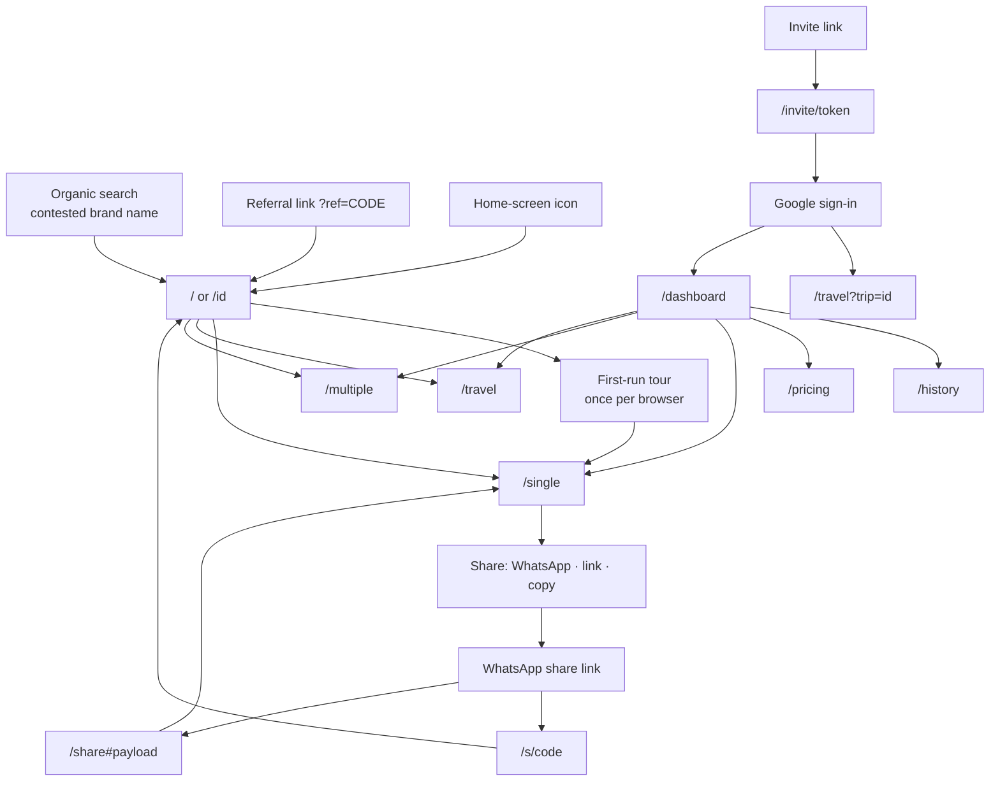

# Splitzy — Information Architecture

> Navigation map built from the actual route tree in `src/app/`. No route here is invented.
> Access levels were **verified by request**, not only read from the proxy config — one of them does
> not behave as configured.
>
> Evidence labels: **[IMPLEMENTED]** · **[INFERRED]** · **[VISUAL-VERIFIED]** · **[UNKNOWN]**

---

## 1. The map

```text
PUBLIC — marketing
  /                        Landing (English, default locale, un-prefixed)
  /id                      Landing (Bahasa Indonesia)
  /about        /id/about  Brand and principles
  /faq          /id/faq    Frequently asked questions
  /privacy                 Privacy policy      (English only)
  /terms                   Terms of service    (English only)
  /pricing                 Free vs Pro         (flag-gated → 404 when off)

PUBLIC — tools
  /single                  Single receipt wizard   ?step= ?resume= ?lang=
  /travel                  Travel Spend            ?trip=  ?view=
  /multiple                Multiple receipts       ⚠ intended auth-only — see §4

PUBLIC — read-only link surfaces  (noindex + robots-disallowed)
  /s/[code]                Server-rendered snapshot of a split
  /share#<payload>         Client-only view; payload never reaches the server
  /invite/[token]          Invite landing → sign in → join a trip

AUTHENTICATED                                     (noindex)
  /dashboard               Quota · referral · quick actions
  /history                 Saved splits, searchable
  /history/[id]            One saved split, read-only

ADMIN                                             (noindex)
  /admin                   Users · quota · bans · roles · activity · audit

OPERATIONAL
  /maintenance             Shown only when MAINTENANCE_MODE=true   (noindex)
  not-found (404)          Any unmatched route
  error (500)              Any uncaught render error
```

---

## 2. Access matrix — verified by request

Every row was probed against a production build on `localhost:3200`. **[VISUAL-VERIFIED]**

| Route | Intended | Enforced by | Observed (anonymous) | Match |
|---|---|---|---|---|
| `/`, `/id` | public | — | 200 | ✅ |
| `/about`, `/id/about`, `/faq`, `/id/faq` | public | — | 200 | ✅ |
| `/privacy`, `/terms` | public | — | 200 | ✅ |
| `/pricing` | public, flag-gated | `isEnabled("pricingPage")` → `notFound()` | 200 *(flag on locally)* | ✅ |
| `/single` | public | — | 200 | ✅ |
| `/travel` | public (local mode) | — | 200 | ✅ |
| **`/multiple`** | **authenticated** | `protectedPaths` in `src/proxy.ts` | **200 — full tool rendered** | ❌ **fails** |
| `/dashboard` | authenticated | page-level gate | 200 with an in-page sign-in gate | ✅ degrades safely |
| `/history` | authenticated | proxy **+** page-level gate | 200 with an in-page sign-in gate | ✅ degrades safely |
| `/history/[id]` | authenticated | page-level `router.replace` | redirect | ✅ |
| `/admin` | admin | page-level `router.replace` + API 403 | redirect | ✅ |
| `/s/[code]` | public | — | 200, "not found" state | ✅ |
| `/share` | public | — | 200, "empty link" state | ✅ |
| `/invite/[token]` | public | — | 200, "invalid or expired" state | ✅ |

---

## 3. Dynamic segments

| Segment | Type | Validation | Not-found behaviour |
|---|---|---|---|
| `/history/[id]` | receipt UUID | server-side ownership check | `404` for missing, soft-deleted, or not-involved |
| `/s/[code]` | 8-char share code, 58-symbol alphabet | direct Prisma lookup by `code` | distinct **expired** vs **not found** states |
| `/invite/[token]` | 128-bit `base64url` | expiry + trip-deleted check | "invalid or has expired" |

`/share` uses a **URL fragment**, not a path segment — deliberately, so the payload never reaches
the server.

---

## 4. The access-control discrepancy **[VISUAL-VERIFIED]**

`src/proxy.ts` lists `/multiple` and `/history` as protected. In practice **neither is protected by
the proxy for an anonymous visitor**, because of this guard:

```ts
if (authError && authError.status !== 401) {
  return response;   // treat as transient — let the request through
}
```

`supabase.auth.getUser()` with no session throws `AuthSessionMissingError`, whose `status` is
**400**, not 401 (`node_modules/@supabase/auth-js/.../errors.js:102`). Every anonymous request
therefore takes the "transient" branch.

| Route | Consequence |
|---|---|
| `/history` | **Degrades safely** — it renders its own in-page sign-in gate |
| `/multiple` | **Fully exposed** — `MultipleReceiptView` uses `isAuthenticated` only to hide two Save buttons; there is no gate, so the entire tool renders and works |

Three knock-on effects:

1. **BR-044 does not hold as documented.** Corrected in
   [business-rules.md](../requirements/business-rules.md).
2. **The sitemap exclusion rests on a false premise.** `sitemap.ts` omits `/multiple` because
   *"an unauthenticated visitor — Googlebot included — is 307'd to `/?login=required`"*. Googlebot
   actually receives a **200 with full content**. The page is crawlable today; it is simply not
   advertised.
3. **The guest split cap does not apply.** `useGuestLimit` is wired into `SingleSplitView` only, so
   `/multiple` offers unlimited anonymous use.

Full write-up: [../security/FINDINGS-PRIVATE.md](../security/FINDINGS-PRIVATE.md) (VULN-001).

---

## 5. Navigation patterns

### Global chrome **[IMPLEMENTED]**

| Element | Where | Behaviour |
|---|---|---|
| Skip link | every page, first tab stop | `.sr-only` until focused → `#main-content` |
| Logo → `/` | most headers | Also **resets the tool locale to the default** unless one is stored |
| `ThemeToggle` | most headers | Persisted, applies `class="dark"` — **[VISUAL-VERIFIED]** |
| `AuthButton` | most headers | Same-height skeleton while resolving, so the header never shifts |
| `LocaleSwitcher` | tool routes + footer | Stores the choice and **reloads** |
| `AppFooter` | most pages | Privacy · Terms · Support · language |

Deliberately **absent**: a persistent global nav bar. Each surface has its own header with a single
back affordance.

### Back navigation **[VISUAL-VERIFIED]**

`/single` keeps its step in the URL (`?step=bill`), so the browser/Android back gesture returns one
step rather than leaving the page. **Exactly one** back control exists in `main` — pinned by
`e2e/wizard-navigation.spec.ts`, and confirmed in the observed tab order (stop 2, "Exit").

### The `?login=required` convention **[IMPLEMENTED]**

Four callers bounce to `/?login=required&redirect=<path>`, where `LoginBanner` renders a prompt:
`/history/[id]`, `/admin`, `UpgradeButton`, and the proxy. The copy is deliberately generic because
one banner serves all of them.

---

## 6. Entry points into the product



**[INFERRED]** The loop that matters commercially is `/single → share → WhatsApp → /s/<code> → a new
visitor`. That loop currently terminates on an **English-only** page in an Indonesian market
(UX-005).

---

## 7. Depth and reachability

| Destination | Clicks from `/` | Note |
|---|---|---|
| A completed split | 3 (mode → fill → summary) | Shallow by design |
| Share the result | 4 | |
| Saved-split history | 2 (sign in → history) | |
| Pro checkout | 2 | |
| Referral link | 2 (sign in → dashboard) | |
| Admin | 2 | |
| **Delete a saved split** | **∞ — unreachable** | API exists, no UI (UX-015) |
| **Export to CSV** | **∞ — unreachable** | Module exists, no UI (UX-016) |

**[IMPLEMENTED]** Every screen is reachable from `/` except the two capabilities above, which have
no entry point at all.

---

## 8. Localisation of the IA **[IMPLEMENTED]**

| Tree | Locale source | Routes |
|---|---|---|
| Marketing | **URL** — `/` vs `/id` | `/`, `/about`, `/faq` (× 2) |
| Tools | **Persisted preference** — `?lang=` → `localStorage` → `navigator.language` | `/single`, `/multiple`, `/travel` |
| Everything else | none — hardcoded English | legal, pricing, dashboard, history, share, invite, admin, 404/500 |

**[VISUAL-VERIFIED]** Preference carry-over works: after visiting `/id`, subsequent tool routes
rendered in Indonesian for the remainder of the browser context.

Only `/`, `/about` and `/faq` emit hreflang, because Google ignores non-reciprocal annotations and
the tool routes have no second URL.

---

## 9. IA observations

| # | Observation | Label |
|---|---|---|
| 1 | Flat and shallow — a split is three clicks from a cold landing | **[INFERRED]** strength |
| 2 | No global navigation; each surface owns its header. Consistent, but there is no way to jump between tools without going through `/` or `/dashboard` | **[IMPLEMENTED]** |
| 3 | The tool routes have no Indonesian URL, so the highest-value keyword pages are single-locale | **[IMPLEMENTED]** |
| 4 | `/multiple` is excluded from the sitemap for a reason that is not true | **[VISUAL-VERIFIED]** |
| 5 | Two capabilities have no entry point anywhere in the IA | **[IMPLEMENTED]** |
| 6 | The public link surfaces are correctly `noindex` **and** robots-disallowed — user data, not content | **[IMPLEMENTED]** |
