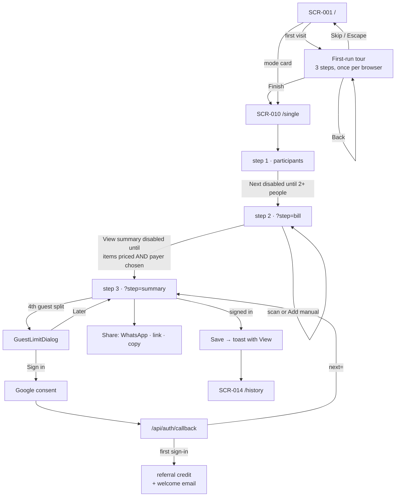
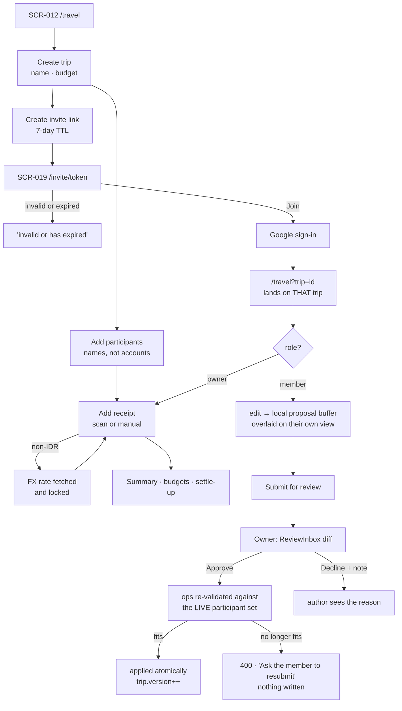
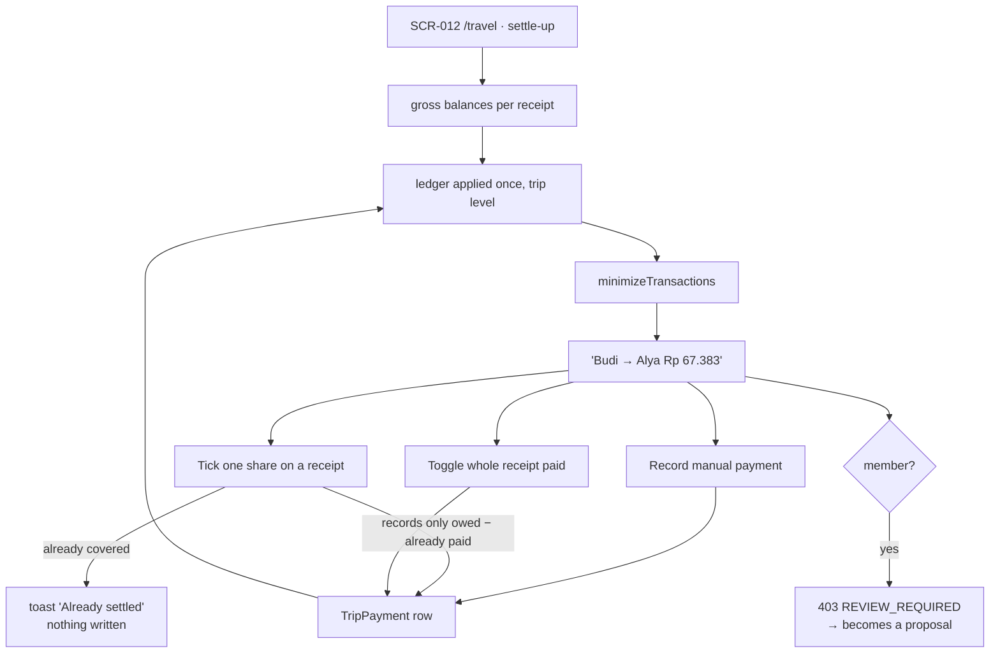
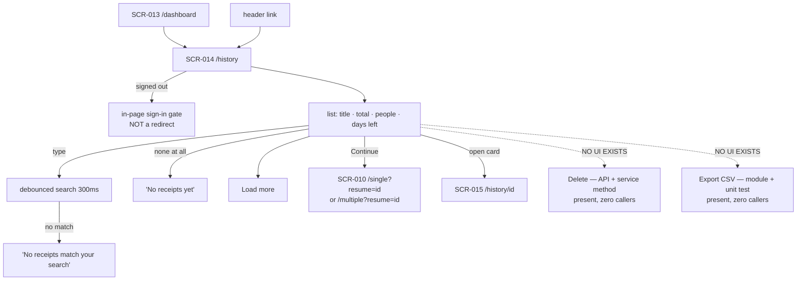
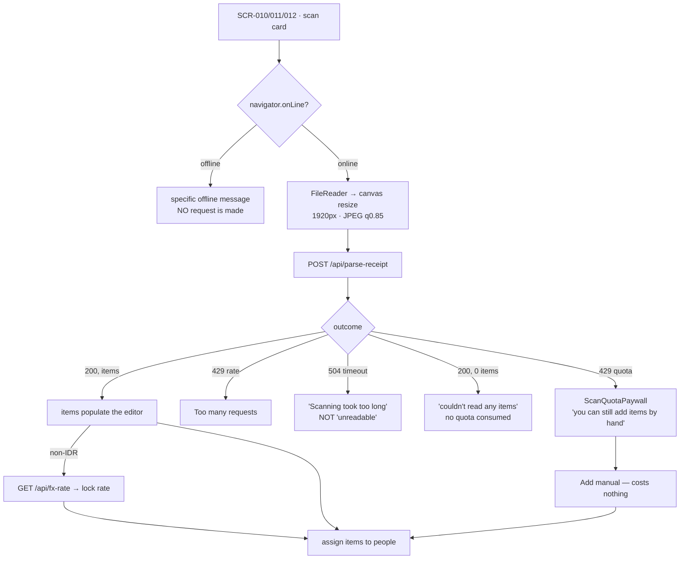
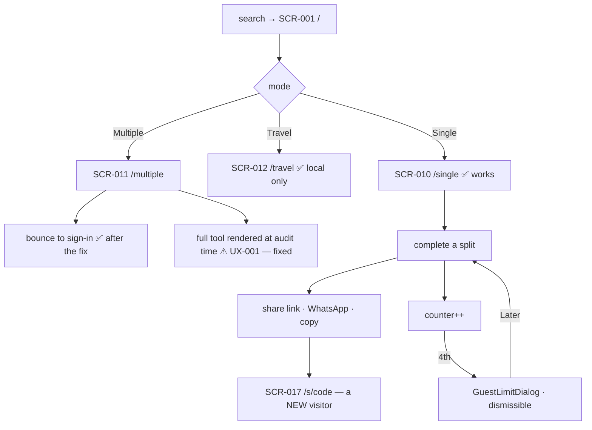
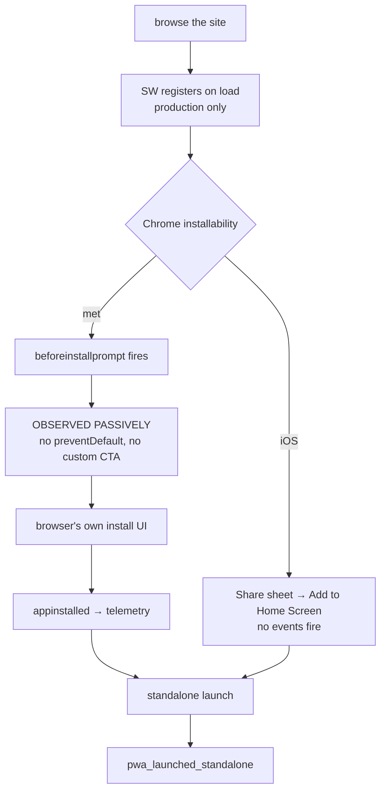
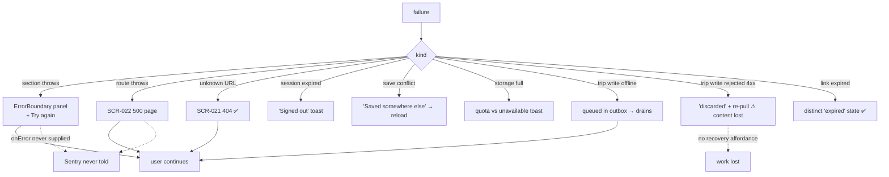

# Splitzy — User Flows (screen level)

> Screen-to-screen diagrams for every major journey. Where Phase B's
> [user-journeys.md](../product/user-journeys.md) maps *steps, APIs and business rules*, this
> document maps *screens and the transitions between them* — including the dead ends.
>
> Transitions marked ✅ were exercised against a running production build during this phase.
>
> `SCR-xxx` → [screen-inventory.md](./screen-inventory.md) · `UX-xxx` → [ux-audit.md](./ux-audit.md)

---

## Flow 1 — Sign up → onboarding → first split

**Verified ✅** The tour ends on `/single`, not on a dismissal. `Next` is genuinely `disabled` at
step 1 with fewer than two participants, and `View summary` stays `disabled` until every item has a
price and a payer is chosen — confirmed by driving the wizard.

**Dead end ⚠** After signing in from `G`, local work is **not** migrated. The user must press Save,
and nothing at that moment tells them so (UX-020).

---

## Flow 2 — Trip: create → invite → contribute → approve

Splitzy has no "groups". The collaborative container is a **trip**.

**Notable** A member never sees a permission error as a wall — their edit silently becomes a
proposal and is shown to them overlaid on the trip. That is a considered piece of interaction design.

**Dead end ⚠** Path `Q`: the member's work must be redone from scratch. There is no "rebase" or
partial-apply affordance.

---

## Flow 3 — Settlement

**The divergence that is invisible to users ⚠ (UX-007).** The identical-looking checkbox in
`/single` and `/multiple` is a **cosmetic `localStorage` flag** that does not change any number, does
not sync, and silently resets when an amount changes. Only Travel has a real ledger. Nothing in
either UI signals the difference.

---

## Flow 4 — Transaction history

**Verified ✅** The signed-out gate renders in place rather than bouncing to the marketing landing —
a deliberate and good choice.

**Two dead ends ⚠** The dotted paths are the clearest UX gaps in the product: both capabilities are
finished in code and have no entry point (UX-015, UX-016).

---

## Flow 5 — AI receipt scan

**Verified ✅** A localised privacy notice sits directly beneath the scan control: *"Your photo is
sent to Google Gemini for parsing and is not stored by Splitzy. Avoid uploading receipts with
sensitive personal data."* Disclosure at the point of risk.

**Design strength.** Four failure modes, four distinct messages, each traceable to an observed user
behaviour. The paywall names the free alternative rather than just stating the rule.

---

## Flow 6 — Anonymous calculator

**Verified** `E2` was the observed behaviour at audit time: `/multiple` returned 200 and rendered
the complete tool to an anonymous request. **Fixed** — it now 307s to `/?login=required`, and the
screen additionally gates itself.

---

## Flow 7 — PWA install

**Design decision, not an omission.** Calling `preventDefault()` would suppress Chrome's own UI and
make Splitzy responsible for surfacing an install affordance — *"if that UI is ever missing or buggy
we would remove installs rather than add them."*

---

## Flow 8 — Error recovery

**Verified ✅** The 404 returns a real HTTP 404 and renders at both viewports and in dark mode. The
share and invite screens distinguish *expired* from *not found*.

**Two weaknesses ⚠** Path `M` loses the receipt content with one generic message. Path `N` means
none of this is visible to the operator (UX-019).

---

## Cross-flow observations

| # | Observation | Label |
|---|---|---|
| 1 | Validation is **proactive and blocking** — the primary action stays disabled and names the specific missing thing | **[VISUAL-VERIFIED]** strength |
| 2 | Every failure path leaves the user somewhere they can act from; only the discarded outbox op is a true dead end | **[IMPLEMENTED]** |
| 3 | The two hard dead ends in the whole product are *delete* and *export* — both finished in code | **[IMPLEMENTED]** |
| 4 | Flow 6 does not behave as designed: `/multiple` is open | **[VISUAL-VERIFIED]** |
| 5 | Every flow that ends in sharing ends on an English-only screen | **[IMPLEMENTED]** |
| 6 | Sign-in mid-flow silently abandons local work unless the user knows to Save | **[IMPLEMENTED]** |
